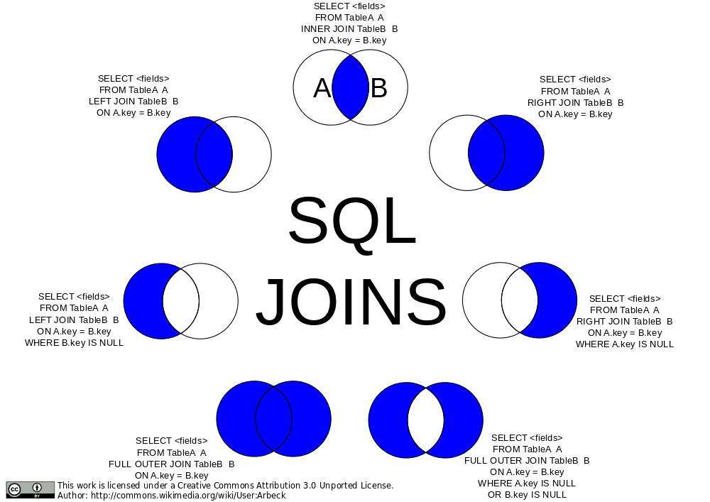

## Complex SQL Queries

### Foreign Keys

Let's jot down all of our schemas for our users, boards, and comments.

```sql
CREATE TABLE users (
    user_id INTEGER PRIMARY KEY GENERATED ALWAYS AS IDENTITY,
    username VARCHAR ( 25 ) UNIQUE NOT NULL,
    email VARCHAR ( 50 ) UNIQUE NOT NULL,
    full_name VARCHAR ( 100 ) NOT NULL,
    last_login TIMESTAMP,
    created_on TIMESTAMP NOT NULL
);

CREATE TABLE boards (
    board_id INTEGER PRIMARY KEY GENERATED ALWAYS AS IDENTITY,
    board_name VARCHAR ( 50 ) UNIQUE NOT NULL,
    board_description TEXT NOT NULL
);

CREATE TABLE comments (
    comment_id INTEGER PRIMARY KEY GENERATED ALWAYS AS IDENTITY,
    user_id INT REFERENCES users(user_id) ON DELETE CASCADE,
    board_id INT REFERENCES boards(board_id) ON DELETE CASCADE,
    comment TEXT NOT NULL,
    time TIMESTAMP
);
```

-   The first two should look pretty familiar. The only new-ish thing is the user of the `TEXT` data type. This is basically a VARCHAR with no cap (or rather a very large cap.) It has some other small differences but for now just know it's uncapped text.
-   `user_id INT REFERENCES users(user_id)` is technically all you need to make a foreign key. The first part, `INT`, makes it known that this key will be stored as an integer. It then uses the `REFERENCES` key word to let PostgreSQL know that it is a foreign key. A foreign key is a field in one table that references the **primary** key of another table. In this case, a comment will reference the user\_id in another table, the users table. The `users` part say it's reference the users table and the `(user_id)` is the name of the key in the other table. In this case, we called both user\_id (which will probably happen somewhat frequently but not always) so they match but if we had called the user\_id just id in the users table, we'd put `id` there.
-   `ON DELETE CASCADE` lets PostgreSQL know what to do if the user gets deleted. So if a user makes a comment on the message board and then deletes their account, what do you want it to do? If you omit the `ON DELETE CASCADE` part, it's the same as doing `ON DELETE NO ACTION` which means it'll just error and not let you delete the user until you've deleted all the comments first. You can also do `ON DELETE SET NULL` which means it'll make the user\_id null on any comment that was made by that user.
-   We've dne the same for board\_id, just referencing the boards table instead of the users table.

<details>
  <summary>Create some records for the tables.</summary>
</details>

### JOIN

So a user goes to your message board and click

```sql
SELECT comment_id, user_id, LEFT(comment, 20) AS preview FROM comments WHERE board_id = 39;
```

-   Two new things here. The `LEFT` function will return the first X characters of a string (as you can guess, RIGHT returns the last X charcters). We'r doing this because this hard to read otherwise in the command line.
-   The `AS` keyword lets you rename how the string is projected. If we don't use AS here, the string will be returned under they key `left` which doesn't make sense.

We can't really use this to display the comments on our web app because your users don't care what user\_id posted these comments, they want the username. But that doesn't live in the comments table, that exists in the users table. So how do we connect those together?

```sql
SELECT
    comment_id, comments.user_id, users.username, time, LEFT(comment, 20) AS preview
FROM
    comments
INNER JOIN
    users
ON
    comments.user_id = users.user_id
WHERE
    board_id = 39;
```

Magic! The big key here is the `INNER JOIN` which allows us to match up all the keys from one table to another. We do that in `ON` clause where we say user_ids match is where you can \_join_ together those records into one record.

Let's talk about `INNER` for a second. There are multiple kinds of JOINs. INNER is a good one start with. It says "find where user\_ids match. If you find a record where the user\_id exists in one but not in the other, omit it in the results." This isn't a particularly useful distinction for us right now becase all user\_ids will exist in users and we're assured of that due to the foreign key restraints we used. However if a comment had a user\_id that didn't exist, it would omit that comment in the results.

[](https://commons.wikimedia.org/wiki/File:SQL_Joins.svg)

A `LEFT JOIN` would say "if a comment has a user\_id that doesn't exist, include it anyway." A `RIGHT JOIN` wouldn't make much sense here but it would include users even if they didn't have a comment on that board.

We can also an `OUTER JOIN` which would be everything that _doesn't match_. In our database, that would be nothing because we're guaranteed everything has match due to our constraints.

You can also do a `FULL OUTER JOIN` which says just include everything. If it doesn't have a match from either side, include it. If it does have a match, include it.

Another rarely useful join is the `CROSS JOIN`. This gives the _Cartesian product_ of the two tables which can be enormous. A Cartesian product would be every row matched with every other row in the other table. If you have A, B, and C in one table with D and E in the other, your CROSS JOIN would be AD, AE, BD, BE, CD, an CE. If you do a cross join between two tables with 1,000 rows each, you'd get 1,000,000 records back.

One neat trick we could do here is a NATURAL JOIN.

```sql
SELECT
    comment_id, comments.user_id, users.username, time, LEFT(comment, 20) AS preview
FROM
    comments
NATURAL INNER JOIN
    users
WHERE
    board_id = 39;
```

This will work like it did above. NATURAL JOIN tells PostgreSQL "I named things the same in both tables, go ahead and match it together yourself. This is fun when it lines up but I don't often end up using it myself. And in the end it's often better to be explicit what about your intent is for joins. So use cautiously and/or for neat party tricks.

### GROUP BY

What if you were making a report and you wanted to show the top ten most posted-to message boards? You could run something like this.

```sql
SELECT
    boards.board_name, COUNT(*) AS comment_count
FROM
    comments
INNER JOIN
    boards
ON
    boards.board_id = comments.board_id
GROUP BY
    boards.board_name
ORDER BY
    comment_count DESC
LIMIT 10;
```

`GROUP BY` is going to collapse all the same board\_names (guaranteed unique due to our UNIQUE constraint on the board) and then we use the `COUNT(*)` to count how many boards have that same `board_name`. So this works! This will give us the precise number of comments on the top board!