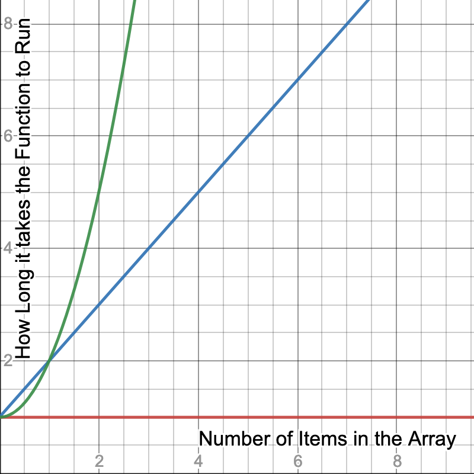
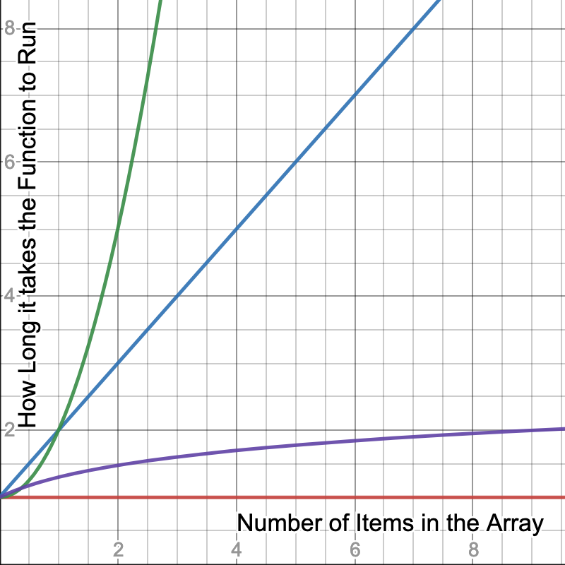

## Time Complexity

Big O is the way we analyze how efficient algorithms are (or code in this case) without getting too mired in the details. We can model how much time any function is going to take given n inputs (think an array of length `n`), but in reality we're interested in the order of magnitude of the number and not necessarily of the exact figure.

Example: I don't particularly care if a function takes 300 milliseconds versus 330 milliseconds given 1,000 inputs, but I do care if it takes 300 milliseconds versus 30 seconds. This would be a difference in an order of magnitude, or basically we're saying we only care if the difference is large.

Enter Big O. Think of the O as a vacuum that sucks in all the unimportant information and just leaves you with the important stuff. Let's look at a purely mathematical perspective for a second. Say we have the equation 3x² + x + 1. If we plug in 5, the first term will be 75, the second term will be 5, and the third will be 1.

> A "term" in mathematics just means one piece of the equation (normally separated by + or - signs). In 3x² + x + 1, 3x² is the first term, x is the second, and 1 is the third.

In other words, most of the piece of the pie comes from the first term, to the point we can just ignore the other terms. If we plug in huge numbers, it becomes even more apparent. IE if we do 5,000,000, the first term is 75,000,000,000,000, the second is 5,000,000, and the last 1. A huge gap.

Hence this is what Big O does; we ignore the little parts and concentrate on the big parts. Keeping with 3x² + x + 1, the Big O for this equation would be O(n²) where O is just absorbing all the other fluff (including the factor on the biggest term.) Just grab the biggest term. So for n terms, it's going take us n\*n time to go through our inputs. So let's see how to derive this from an algorithm.

```javascript
function crossAdd(input) {
  var answer = []
  for (var i = 0; i < input.length; i++) {
    var goingUp = input[i]
    var goingDown = input[input.length - 1 - i]
    answer.push(goingUp + goingDown)
  }
  return answer
}
```

This is O(n) because we go through all the inputs once in a loop.

```javascript
function find(needle, haystack) {
  for (var i = 0; i < haystack.length; i++) {
    if (haystack[i] === needle) return true
  }
}
```

Still O(n). Unless we say otherwise, we're assuming worst case scenario. In this worst case, the needle would be the last element.

```javascript
function makeTuples(input) {
  var answer = []
  for (var i = 0; i < input.length; i++) {
    for (var j = 0; j < input.length; j++) {
      answer.push([input[i], input[j]])
    }
  }
  return answer
}
```

This would be O(n²). For every input, we have to go through a full loop inside of another full loop, meaning we're doing a lot of work! This is the trick: look for loops. A loop inside of a loop inside of a loop would likewise be O(n³).

If we have no loops and just do something and exit/return, then it's said we're doing it in constant time, or O(1).

```javascript
function getMiddleOfArray(array) {
  return array[Math.floor(array.length / 2)]
}
```

This would be O(1) because no matter how long the array is, this still takes the same amount of time to do.

For some people, it's helpful to use a graph to visualize what we're talking about here



Here we see a graph that represents the more items we put in a array, how long does it take for the function to complete. The red graph represnts O(1) like our `getMiddleOfArary` function. You can throw an array of 1,000,000 at it and it still takes the same amount of time as if the array was 10 big.

The blue line represents a function that takes longer based on how many items are in the array similar to `crossAdd` or `find` and it grows a steady rate. If it takes 10ms to run a function with a 100 items in it, we could reasonably expect it would take 10 times longer-ish (remember, these are broad strokes, not precise figures) if we had 10 times the amount of things in the array.

The green line is where we get start getting scary. For every item we add to the array, it takes exponentially more time to complete the operation. Adding 10x the items could cause a function to takes 100x longer since it's O(n²). It gets even scarier at O(n³) as it would take 1000x longer.

We'll get more into it later, but you can also have O(log n) if a code employs a divide-and-conquer strategy (often recursive,) meaning as you add more terms, the increases in time as you add input diminishes. We'll talk more about that with merge and quick sort.



Notice the purple line we added. Now as we add more terms to the array, it takes less and less time because the function can make some use of some tricks to take shortcuts. We'll dig into these later in the course.

### Okay, sure, but why

This sort of analysis is useful for taking a high level view. It's a useful tool for deciding if your designed implementation is going to much the performance profile that you need.

A good example would be if we were designing a comment system for a site and it had a sorting and filtering ability. If this is for a school and there would only ever be a few comments at a time, we probably don't need to do too much Big O analysis because it's such a small set of people that a computer can overcome just about any computational inefficiency we have. In this case I'd value human time over computer time and just go with the simplest solution and not worry about the Big O unless performance because a problem later.

Okay, now, if we're designing a comment system but it's for Reddit.com, our needs change _dramatically_. We're now talking about pipelines of millions of users making billions of comments. Our performance targets need to change to address such volume. A O(n²) alogrithm would crash the site.

This is absolutely essential to know about Big O analysis. It's useless without context. If you're asked is in a situation if a O(n) or a O(n²) your answer should be "it depends" or "I need more context". If the O(n) algorithm is extremely difficult to comprehend and the O(n²) algorithm is dramatically easier to understand and performance is a total non-issue, then the O(n²) is a much better choice. It's similar to asking a carpenter if they want a hammer or a sledgehammer without any context. Their answer will be "what do you need me to do?".

## Spatial Complexity

So far we've just talked about _computational complexity_. In general if someone talks about Big O and doesn't specify what type they're talking about, it's usually about computational complexity, or analyzing how long something takes to run. Let's talk about _spatial complexity_ or how much space (e.g. how much RAM or disk space) an algorithm needs to complete.

### Linear

Let's say we have an algorithm that for every item in the array, it needs to create another array in the process of sorting it. So for an array of length 10, our algorithm will create 10 arrays. For an array of 100, it'd create 100 extra arrays (or something close, remember these are broad strokes, not exact.) This would be O(n) in terms of its spatial complexity. We'll do some sorts that do this.

### Logrithmic

What about another for every item in the array, it needed to create a diminishing amount of extra arrays. For example: for an array of length 10, it'd create 7 arrays. For an array of 100, it'd create 12 arrays. For an array of 1000, it'd created 20 arrays. This would be O(log n).

### Constant

What if we didn't create any extra arrays when we did our algorithm? We just used the same space we were given when we first started. Or if we created just 10 arrays, no matter how long the array is? This would be O(1) since it's constant no matter what. Its spatial need don't increase with longer arrays.

### Quadratic

Lastly, what if we had an app that calculates the distances between zip / postal codes?

> A zip code in the United States is a five digit number that represents a fairly small area of land. 98109 is in the middle of Seattle, Washington while 10001 is in the middle of New York City, NY.

If a user asks what's the distance between 98109 and 10001, we'd spit out something like 2,800 miles or 4,500 km. Now, let's say for every zip code we add to our system, we calculate the distance between every other zip code in our system and store it. If there were only 10 zip codes, sure, that'd be easy, but there are nearly 42,000 zip codes in the United States with more being added. The spatial complexity on this would be O(n²) because for every new zip code we add, we'd have to add 42,000 new items as well.

Is this a good idea? It depends! A company I used to work at did exactly this because calling the API to get this data was really expensive so they did all the computational work once to find out and just stored it. It was a huge database but that ended up being way cheaper than the API.

I will say O(n²) in spatial complexity is pretty rare and a big red flag.

### Okay, sure, but why

As before, this is just a tool to make sure your design fits your needs. One isn't necessarily better than the other. And very frequently you need to make the trade off of computational complexity vs spatial. Some algoriths eat a lot of memory but go fast and there are lots that eat zero memory but go slow. It just depends on what your needs are.

Here's an example: let's say you're writing code that's going to be run a PlayStation 3 and it needs to sort 1000 TV shows according to what show you think the customer is going to want to see. PS3s have a decent processor but very little memory available to apps. In this case, we'd want to trade off in favor of spatial complexity and trade off against computational complexity: the processor can do more work so we can save memory.

Okay, now same problem but we have 1,000,000 videos and a big, beefy server in the cloud to do the work for us. In this case we're not resource constrained by either memory or compute so we can feel free to trade off in favor of computational since we want to respond to the user as soon as we can.

## The mindset

It's actually the mindset that you're gaining that's actually the useful part. "If I nest a for loop in another for loop, that could be bad." If you gain nothing else from these two sections, gain that!

Really though, it's the additional function in my brain that as I'm writing code is thinking about "can this be done better".

Let's talk about "better" for a second. The temptation after learning about these concepts is to try to optimize every piece of code that you come across. "How can this have the loweset Big O?" is the wrong question to ask. Let's go over some guiding principles.

- There are no rules. "Always do _blank_". Everything has context. These are just tools and loose decision-making frameworks for you to use to make a contextually good choice.
- There are frequently multiple good choices and almost never a perfect, "right" choice.
- Remember how I said that Big O allows you to ignore the coefficients (the `3` in the `3x²`)? Sometimes those actually end up being super important. Big O, again, is just a broad stroke. Sometimes the details are super important.
- Just as frequently, even the broad strokes are super unimportant. If you have a function that is called just once a day as a background job, it doesn't matter if it finishes in 300 milliseconds or 30 seconds (probably, again, context is important.) Don't spin your wheels on unimportant things.
- In my experience, **readability** and **maintainability** are the most important things about code. Code is communication. Clever, performant code is fun to write but hard to maintain later when you have to go figure out what the hell you actually wrote. We write code so that later humans can understand it and secondarily so computers can execute it. If it was just for computers we'd all still be writing assembly. Write your code like you were writing a letter to a future human (probably yourself) on how this works.
- Taking the above into account, err on the side of simple code. Simple code is easier to maintain because you can understand it easier and typically ends up having less bugs.
- Human time is almost always more valuable than computer time.
- Normally it's a good idea to not prematurely optimize code. As a general principle, I try to _have_ a perf problem before I try to solve it. Premature optimization will cause you a lot of problems. Frequently you're not solving the right problem and you're left when harder-to-deal-with code.
- 99% of the time you want to use the built-in features to a language or an existing module to do these sorts of heavy lifting. Rarely are you going to write your own sort, you'll just call `.sort()`. Usually your implementation won't be faster because the built-ins can do tricks you can't (like run it in C/Rust) and they tend to have far less bugs because so many people use them.
