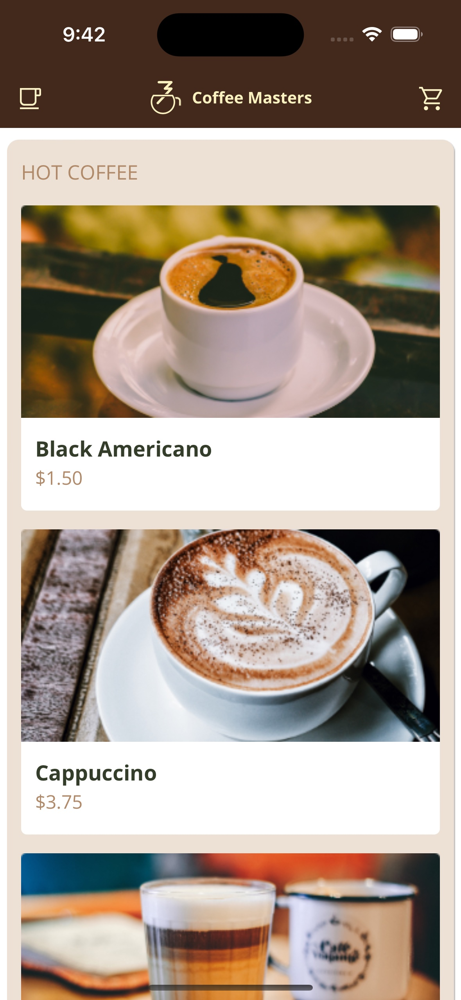

## #2 The project

> **Let's setup our local development environment and get started with the project.**

## Course project overview



We will build an application to order coffee on the go. The app will have the following characteristics:

1. Technology Stack:

   - HTML and CSS are already prepared.
   - JavaScript will be used but is not yet implemented.
   - Web components will be created, and data will be fetched using HTTP.
   - Data (menu) is in a JSON file.

2. Hosting:

   - The app will be hosted on a local web server to bypass security restrictions.
   - Various local servers or plugins like "Go Live" in VSCode can be used for this purpose.

3. Progressive Web App (PWA):
   - The app is also a PWA, meaning it can be installed and will have its own window and icon in the operating system.

## Setup

1. **Introduction of JavaScript to the project:**

   - The project initially doesn’t contain any JavaScript. A new JavaScript file, specifically `app.js`, will be introduced as the entry point of JavaScript in the project.

2. **Modern JavaScript Practices:**

   - Emphasis is placed on using modern JavaScript features like ECMAScript modules, async-await, and class declarations, which are part of ES 2017 and onwards. This approach is compatible with most modern browsers except older versions like IE 9.

3. **Organization of Files:**

   - Rather than having a scripts folder, it’s suggested to organize the files differently, aligning more with the practices common in libraries, where files are organized based on components and services rather than just being scripts.

4. **JavaScript File Loading:**

   - Browsers parse HTML line by line, and when a script tag is found, the parsing is halted to fetch and execute the JavaScript file.
   - Legacy practices like placing the script tags at the bottom of the body are deemed deprecated.

5. **Attributes: Defer and Async:**
   - The `defer` attribute allows the browser to continue parsing the rest of the HTML while downloading the JavaScript file, executing it after the parsing is complete.
   - The `async` attribute allows the script to be downloaded in parallel but executes it as soon as it’s ready, halting the HTML parsing at that moment.
   - Using `defer` ensures that the script is executed after the HTML is parsed, allowing the page content to load without waiting for the JavaScript file to execute, thus improving page load performance.

```html
<!doctype html>
<html lang="en">
  <head>
    <!-- other head elements -->
    <script src="app.js" defer></script>
  </head>
  <body>
    <!-- body content -->
  </body>
</html>
```
