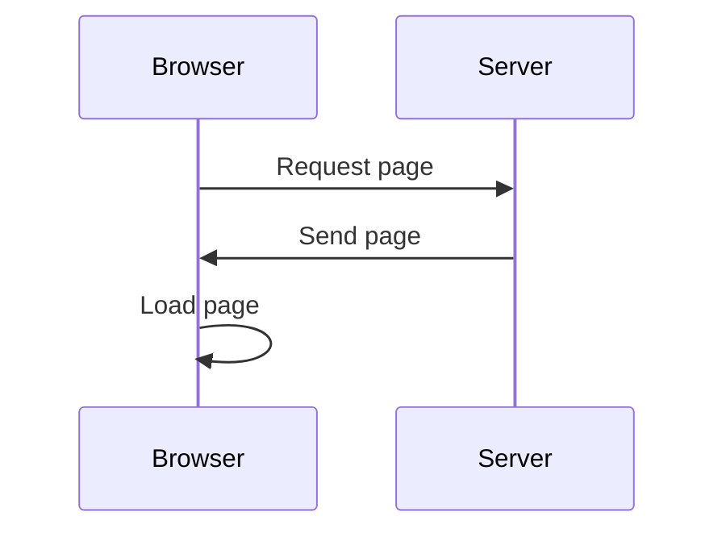
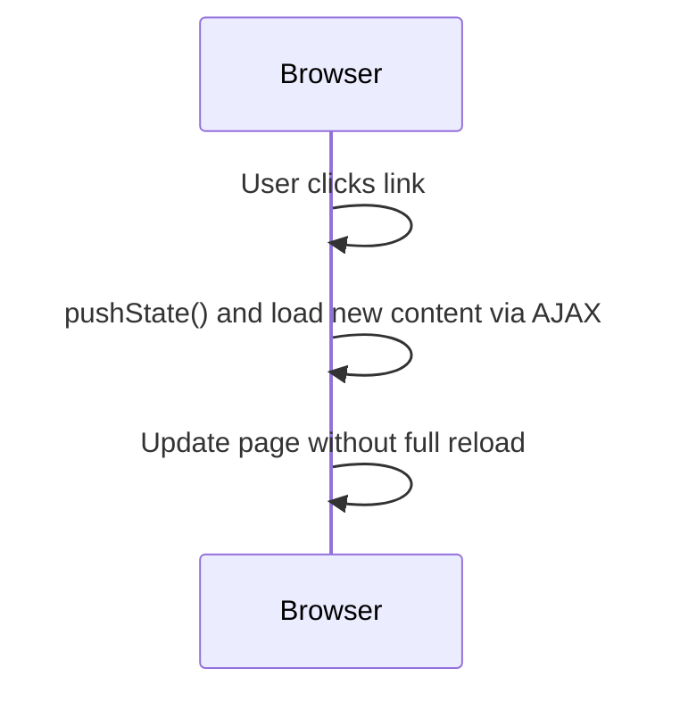
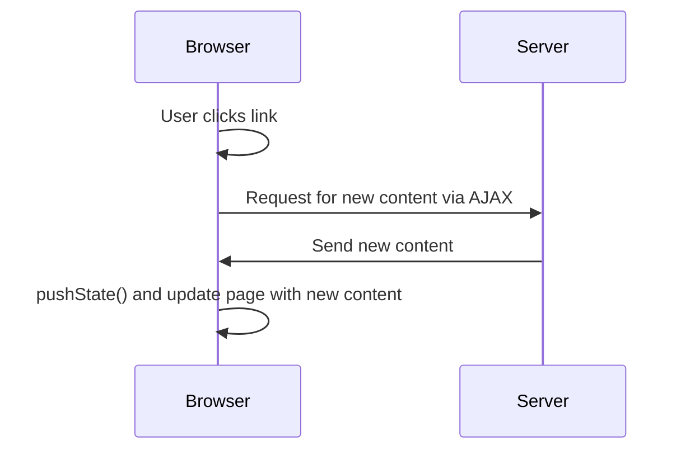

## #5 Client Side Routing (SPA)

> By the end of this section, **you should understand how frameworks are handling client side routing.**

## Routing options

#### Traditional Full Page Reload



- **Traditional Full Page Reload:** The browser requests a page from the server, which sends back the full page content, causing the browser to fully reload the page.

#### Client-side Routing with History API



- **Client-side Routing with History API:** Using the History API, new page content is loaded via AJAX, and the browser URL and content are updated without a full page reload, providing a smoother user experience.

#### Mixed Client-Server Routing



- **Mixed Client-Server Routing:** A combination where new content is requested from the server, received, and then the page is updated using the History API, enabling a more dynamic page update without a full reload.

## Using The History API

- JavaScript's History API enables manipulation of the URL and browser history.
- `history.pushState()` allows for changing the URL without refreshing the page.
- Listening for URL changes can be done using the `popstate` event, and based on these changes, different content can be displayed.

```javascript
// Navigating to a new page
function navigateToPage() {
  history.pushState(
    { page: "newPage" },
    "New Page", // This argument is ignored, can be anthying like null or undefined
    "/new-page",
  )
}

// Handling back and forward buttons
window.onpopstate = function (event) {
  if (event.state) {
    loadPage(event.state.page)
  }
}

// Function to load a new page content
function loadPage(pageName) {
  // Load the page content here
  console.log("Loading", pageName)
}
```

## Project progress

### /services/Router.js

```javascript
const Router = {
  init: () => {
    document.querySelectorAll("a.navlink").forEach((a) => {
      a.addEventListener("click", (event) => {
        event.preventDefault()
        const href = event.target.getAttribute("href")
        Router.go(href)
      })
    })
    // Process initial URL
    Router.go(location.pathname)

    window.addEventListener("popstate", (event) => {
      Router.go(event.state.route, false)
    })
  },
  go: (route, addToHistory = true) => {
    if (addToHistory) {
      history.pushState({ route }, "", route)
    }
    let pageElement = null
    switch (route) {
      case "/":
        pageElement = document.createElement("h1")
        pageElement.textContent("Menu")
        break
      case "/order":
        pageElement = document.createElement("h1")
        pageElement.textContent("Menu")
        break
      default:
        if (route.startsWith("/product-")) {
          pageElement = document.createElement("h1")
          pageElement.textContent("Details")
          pageElement.dataset.productId = route.substring(
            route.lastIndexOf("-") + 1,
          )
        }
        break
    }
    if (pageElement) {
      document.querySelector("main").innerHTML = ""
      document
        .querySelector("main")
        .appendChild(pageElement)
    }

    window.scrollX = 0
  },
}

export default Router
```

And let's import this new service from app.js and call it from DOMContentLoaded

```javascript
import Router from "./services/Router.js"

window.addEventListener("DOMContentLoaded", () => {
  app.router.init()
  loadData()
})
```
