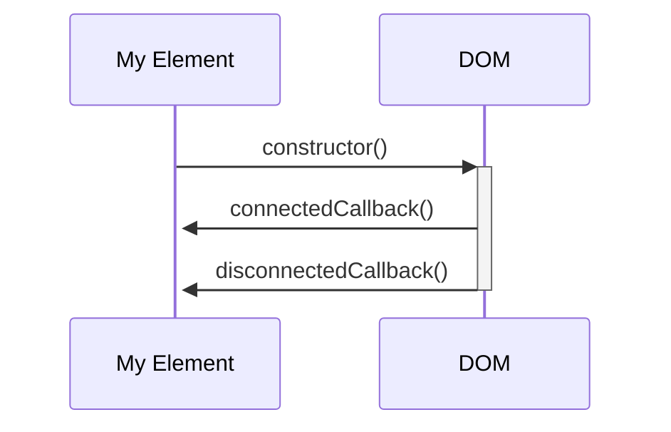

## #6 Web components

> By the end of this section, **you should understand how you can create your own web components.**

## Web components

Web Components allow you to create modular and reusable components, acting as building blocks for web development. They encapsulate a set of related functionalities and UI elements, similar to components in React and Angular.

### Compatibility

Web Components are more compatible with browsers today than they were five years ago. However, some features, like Declarative Shadow DOM, may not be fully compatible with all browsers, such as Safari.

<iframe src="https://caniuse.com/custom-elementsv1" ></iframe>

### Custom Elements

Custom Elements enable you to define new, reusable HTML elements with custom behaviors and functionalities using JavaScript.

```javascript
class MyElement extends HTMLElement {
  constructor() {
    super()
    // Initial setup and state
  }

  connectedCallback() {
    // When the element is added to the DOM
  }

  disconnectedCallback() {
    // When the element is removed from the DOM
  }

  attributeChangedCallback(name, oldValue, new Value() {
    // When an attribute is added, removed, or updated
  }
}

customElements.define("my-element", MyElement)
```



### Attributes and Lifecycle

Custom Elements can have attributes, often prefixed with `data-`, and have access to a lifecycle similar to other frameworks, with hooks like `connectedCallback` and `disconnectedCallback`.

```javascript
class MyElement extends HTMLElement {
  connectedCallback() {
    const language = this.dataset.language
    // Use the language attribute
  }
}
```

### Slots

Slots allow you to define placeholders within your components where you can inject additional content, enabling more flexible and reusable components.

```html
<my-element>
  <div slot="header">Header Content</div>
  <div slot="footer">Footer Content</div>
</my-element>
```

### Template elements

The `template` element holds a fragment of markup that is not rendered immediately but can be cloned and inserted into the DOM dynamically at runtime. This approach offers reusable HTML content that can be rendered and modified programmatically.

1. **Ignored by Browsers:** The content inside a template tag is ignored by the browser, making it inert until activated via JavaScript.
2. **Dynamically Cloning:** Through DOM APIs, the content of the template can be cloned and inserted into the actual DOM, making it interactive and visible.
3. **Styling:** Styles defined within a template apply globally, unless scoped or encapsulated within Shadow DOM. For example, a style targeting an `h1` tag in a template would affect all `h1` tags in the page unless specified otherwise.

#### Cloning and Using Template Content

```javascript
class MyElement extends HTMLElement {
  connectedCallback() {
    const template = document.getElementById("my-template")
    const content = template.content.cloneNode(true)
    this.appendChild(content)
  }
}
```

#### Defining Template

```html
<template id="my-template">
  <style>
    h1 {
      color: red;
    }
  </style>
  <h1>Template Header</h1>
</template>
```

### Shadow DOM

Shadow DOM allows for the encapsulation of the structure, style, and behavior in a Web Component, enabling the creation of isolated DOM trees.

1. **Isolation and Encapsulation:**

   - Shadow DOM allows for a private, isolated DOM tree within a web component.
   - It separates the component’s internal DOM from the main document’s DOM.

2. **Control Over Styling:**

   - Styles declared inside the Shadow DOM don’t affect the outer DOM.
   - Conversely, styles from the outer DOM don’t bleed into the Shadow DOM.
   - This isolation solves issues related to global styles affecting all similar elements indiscriminately.

3. **Open and Closed Shadow DOM:**

   - Shadow DOM can be ‘open’ or ‘closed.’
   - An ‘open’ Shadow DOM allows access from the outer DOM.
   - A ‘closed’ Shadow DOM restricts access, making it private and accessible only from within the Shadow DOM.

4. **Creating Shadow DOM:**

   - Shadow DOM is typically attached in the constructor of a custom element.
   - A reference to the Shadow DOM, often stored as a property of the object, is used for further operations.

5. **External HTML and Shadow DOM:**

   - Importing external HTML directly, like HTML imports, is deprecated.
   - However, external HTML content can be fetched manually using the Fetch API or other methods.
   - Once fetched, this content can be injected into the Shadow DOM.

6. **Performance and Preloading:**
   - External resources can be preloaded, aiding in performance optimization.
   - Preloading ensures that the resources are available in the cache when needed, reducing load times.

#### Creating and Using Shadow DOM

```javascript
class MyComponent extends HTMLElement {
  constructor() {
    super()
    this.shadow = this.attachShadow({ mode: "open" })
  }
  connectedCallback() {
    this.shadow.innerHTML = `<h1>Shadow DOM Content</h1>`
  }
}
```

## Project Progress

### components/MenuPage.js

```javascript
export default class MenuPage extends HTMLElement {
  constructor() {
    super()

    this.root = this.attachShadow({ mode: "open" })

    const template = document.getElementById(
      "details-page-template",
    )
    const content = template.content.cloneNode(true)
    this.root.appendChild(content)

    async function loadCSS() {
      const request = await fetch("/components/[name].css")
      styles.textContent = await request.text()
    }
    loadCSS()
  }
}
customElements.define("menu-page", DetailsPage)
```

### components/DetailsPage.js

```javascript
export default class DetailsPage extends HTMLElement {
  constructor() {
    super()

    this.root = this.attachShadow({ mode: "open" })

    const template = document.getElementById(
      "details-page-template",
    )
    const content = template.content.cloneNode(true)
    this.root.appendChild(content)

    async function loadCSS() {
      const request = await fetch("/components/[name].css")
      styles.textContent = await request.text()
    }
    loadCSS()
  }
}
customElements.define("details-page", DetailsPage)
```

### components/OrderPage.js

```javascript
export default class OrderPage extends HTMLElement {
  constructor() {
    super()

    this.root = this.attachShadow({ mode: "open" })

    const template = document.getElementById(
      "details-page-template",
    )
    const content = template.content.cloneNode(true)
    this.root.appendChild(content)

    async function loadCSS() {
      const request = await fetch("/components/[name].css")
      styles.textContent = await request.text()
    }
    loadCSS()
  }
}
customElements.define("order-page", DetailsPage)
```

> 💡 If the CSS is dynamically fetch like above, you can prefetch the stylesheet in your HTML definition

### Update the router

In the services/Router.js replace the go function

```javascript
go: (route, addToHistory = true) => {
  if (addToHistory) {
    history.pushState({ route }, "", route)
  }
  let pageElement = null
  switch (route) {
    case "/":
      pageElement = document.createElement("menu-page")
      break
    case "/order":
      pageElement = document.createElement("order-page")
      break
    default:
      if (route.startsWith("/product-")) {
        pageElement = document.createElement("details-page")
        pageElement.dataset.productId = route.substring(
          route.lastIndexOf("-") + 1,
        )
      }
      break
  }
  if (pageElement) {
    document.querySelector("main").innerHTML = ""
    document.querySelector("main").appendChild(pageElement)
  }

  window.scrollX = 0
}
```
