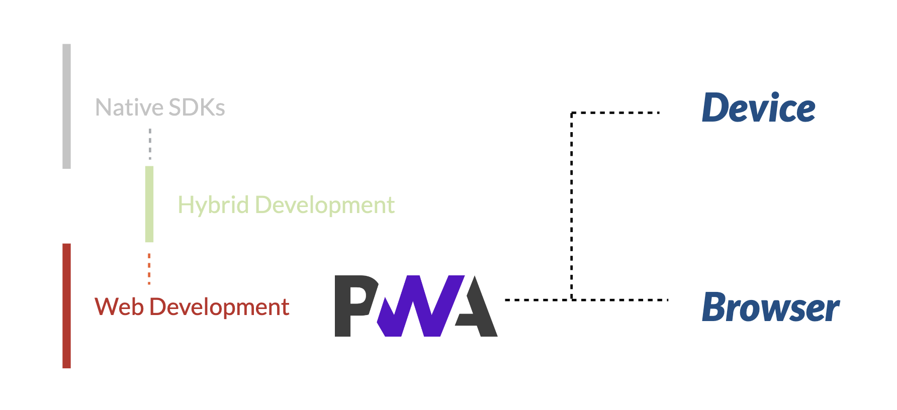
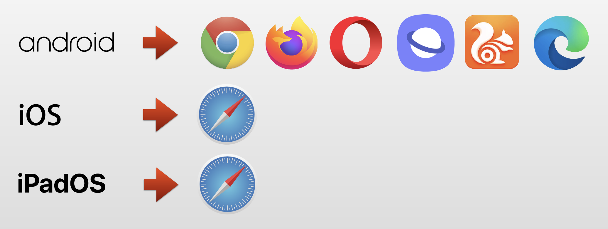
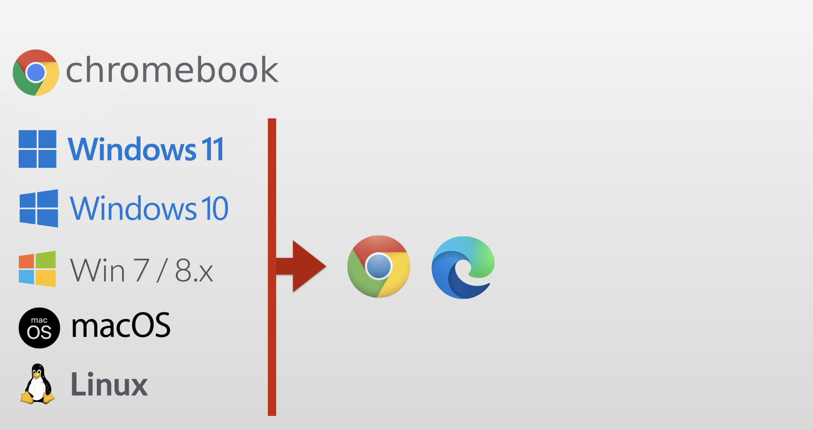
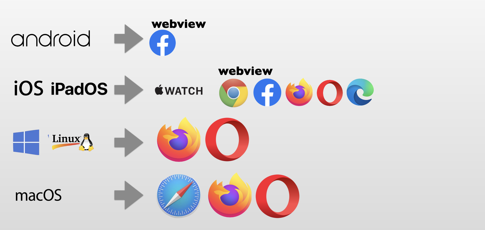

## #9 Progressive Web Apps (PWA)

> By the end of this section, **you should have a solid understanding of the possibilities PWAs offer.**

## What is it?

<iframe src="https://caniuse.com/sr_web-app-manifest"></iframe>

## PWA (Progressive Web Apps) Comparison and Explanation

### Comparison with Other App Development Approaches

- Native SDKs

  - **Example Technologies:** Kotlin (Android), Swift/Objective C (iOS), .NET (Windows)
  - **Target:** Specific Devices
  - **Distribution:** Via respective app stores

- Cross-platform Solutions

  - **Examples:** React Native, NativeScript, Flutter
  - **Target:** Multiple platforms but requires different packages per platform

- Hybrid Development
  - **Examples:** Adobe PhoneGap, Apache Cordova
  - **Target:** Specific Devices, not browsers



### PWA (Progressive Web Apps)

- **Target:** Browsers and Specific Devices
- **Technologies:** JavaScript, JSON, HTML, CSS
- **Distribution:** Directly via web (URLs)

### Benefits of PWAs

- **Ease of Deployment and Update:** Easier to deploy and update compared to native apps
- **Flexibility:** Can use various web technologies and frameworks (React, Vue, etc.)
- **Offline Access:** Improved offline access compared to traditional web apps
- **Integration with OS:** Allows features like push notifications, badges, etc.

### PWAs support

> 86% of browsers are now PWA compatible

#### Mobile



#### Desktop



#### No support



also no support for smart tvs, smartwatches, consoles and XR headsets

## Components of PWA

### 1. Web App

- The foundational layer of a PWA is the web app itself. This can be built using common web technologies such as HTML, CSS, and JavaScript.
- Frameworks such as React, Angular, or Vue.js can also be used to develop the web app.

### 2. Web App Manifest

- The Web App Manifest is a JSON file that provides metadata about the application, such as the name, icons, display mode, and background color.
- It allows the web app to be installable and customizable on the user's home screen.

### 3. Service Worker

- Service Workers are scripts that run in the background, separate from the web page.
- They enable features like offline functionality, background sync, and push notifications.

Here is a diagram that illustrates the relationship between these components:

```
+----------------------+
|     Web App          |
|  +-----------------+ |
|  | HTML, CSS, JS   | |
|  +-----------------+ |
+--+------------------+|
   | Web App Manifest  |
   |  +--------------+ |
   |  | JSON file    | |
   |  +--------------+ |
   +--|--------------|-+
      | Service Worker|
      |  +----------+ |
      |  | Script   | |
      |  +----------+ |
      +--------------+
```

In terms of detection, browsers like Chrome and Edge provide built-in tools such as Lighthouse, which can assess whether a web app meets the criteria of a PWA. Lighthouse checks against a set of PWA criteria, and if the web app passes, it enables installation support and may display a hint for user installation. This criteria may evolve over time, impacting aspects such as installation prompts and search engine optimization (SEO).

## Project progress

### /index.html

add the manifest link

```html
<link rel="manifest" href="app.webmanifest" />
```

add the manifest like this:

```json
{
  "name": "Coffee Masters",
  "short_name": "CoffeeMasters",
  "theme_color": "#43281C",
  "display": "standalone",
  "background_color": "#EFEFEF",
  "start_url": "/",
  "scope": "/",
  "description": "The app for order at Coffee Masters, the best coffee shop in the Frontend world",
  "icons": [
    {
      "src": "images/icons/icon.png",
      "sizes": "1024x1024",
      "type": "image/png"
    },
    {
      "src": "images/icons/icon-maskable.png",
      "sizes": "512x512",
      "type": "image/png",
      "purpose": "maskable"
    }
  ],
  "screenshots": [
    {
      "src": "images/screen1.jpg",
      "type": "image/jpeg"
    },
    {
      "src": "images/screen2.jpg",
      "type": "image/jpeg"
    }
  ]
}
```
