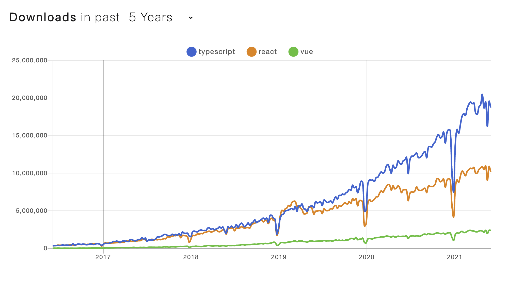

## #1 Goal for this course

> By the end of this course, **I want you to have a rock solid mental model, that will serve you well for years**

## What is TypeScript?

> TypeScript is an [open source](https://github.com/microsoft/TypeScript), typed **syntactic superset** of JavaScript

- Compiles to readable JS
- Three parts: Language, [Language Server](https://microsoft.github.io/language-server-protocol/) and Compiler
- Kind of like a fancy linter

**TypeScript is _increasingly popular_**


## Why developers want types

It allows you, as a code author, **to leave more of your intent "on the page"**

This kind of _intent_ is often missing from JS code. For example:

```js
function add(a, b) {
  return a + b
}
```

Is this meant to take numbers as args? strings? both?

What if someone who interpreted `a` and `b` as numbers made this "backwards-compatible change?"

```js
function add(a, b, c = 0) {
  return a + b + c
}
```

We're headed for trouble if we decided to pass strings in for `a` and `b`!

Types make the author's intent more clear

```ts twoslash
// @errors: 2345
function add(a: number, b: number): number {
  return a + b
}
add(3, "4")
```

**It has the potential to move some kinds of errors from _runtime_ to _compile time_** [^1]

Examples:

- Values that are potentially absent (`null` or `undefined`)
- Incomplete refactoring
- Breakage around _internal code contracts_ (e.g., an argument _becomes_ required)

**It serves as the foundation for a _great_ code authoring experience**

Example: in-editor autocomplete, as shown here:

```ts twoslash
window.setInterval
//       ^|
```

[^1]: TypeScript by itself is not going to reduce the occurrence of errors in your projects. It does, however, provide several tools that _greatly_ improve visibility of some kinds of defects.
