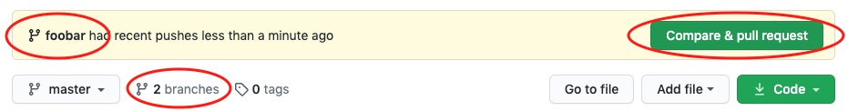
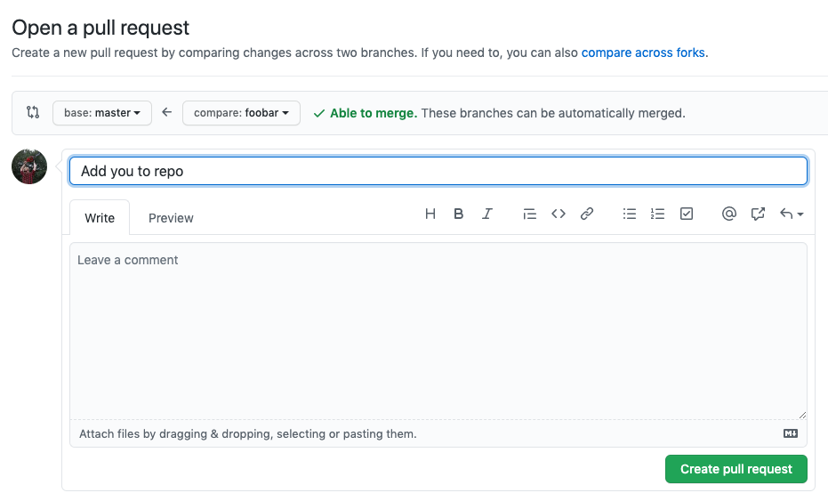
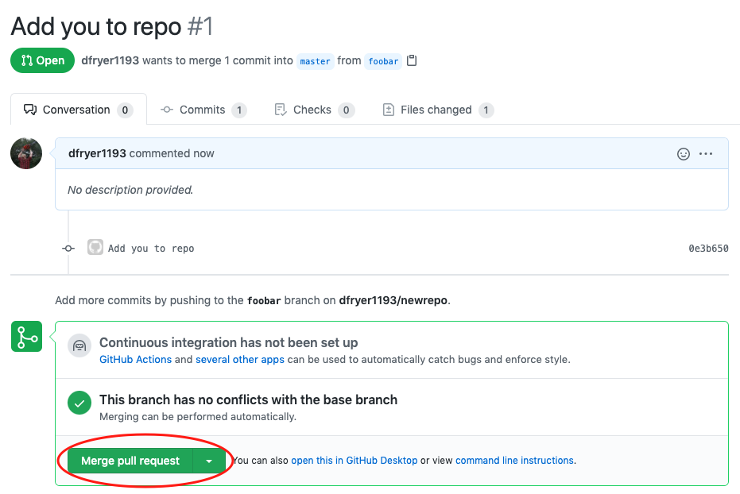
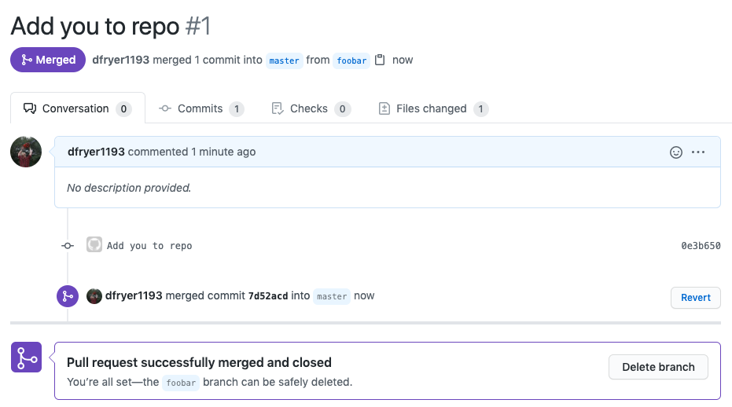
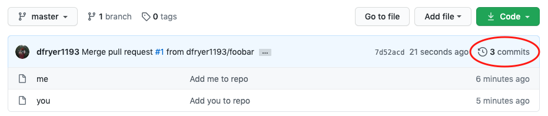

## #1 Goal for this course

> By the end of this course, **I want you to have a good understanding of the high level developer workflow when working in GIT. This should be enough to get you started.**

## What is Git?

Git is version-control software for working on group project collaboration. Not collaboration as in group dynamics and fair distribution of project workloads and who ate the last jelly doughnut, but in the actual mechanics of sharing work back and forth.

Just as Google Drive makes it possible for multiple contributors to write, edit and add to the contents of a single text file, git is a computer program making it possible for multiple coders (and project managers, testers, content providers, and whomever else is on the team) to collaborate on a single project.

## The workflow

### Step 0: Install git and create a GitHub account

The first two things you'll want to do are install git and create a free GitHub account.

Follow the instructions [here](https://git-scm.com/book/en/v2/Getting-Started-Installing-Git) to install git (if it's not already installed). Note that for this tutorial we will be using git on the command line only. While there are some great git GUIs (graphical user interfaces), I think it's easier to learn git using git-specific commands first and then to try out a git GUI once you're more comfortable with the command.

Once you've done that, create a GitHub account [here](https://github.com/join).

---

[[info]]
:bulb: A quick aside: Git and GitHub

**Git and GitHub are not the same thing**. Git is an open-source, version control tool created in 2005 by developers working on the Linux operating system; GitHub is a company founded in 2008 that makes tools which integrate with git. You do not need GitHub to use git, but you cannot use GitHub without using git.

---

### Step 1: Create a local git repository

When creating a new project on your local machine using git, you'll first create a new repository (or often, 'repo', for short).

To begin, open up a terminal and move to where you want to place the project on your local machine using the cd (change directory) command. For example, if you have a 'projects' folder on your desktop, you'd do something like:

```bash
mnelson:Desktop mnelson$ cd ~/Desktop
mnelson:Desktop mnelson$ mkdir myproject
mnelson:Desktop mnelson$ cd myproject/
```

To initialize a git repository in the root of the folder, run the git init command:

```bash
mnelson:myproject mnelson$ git init
Initialized empty Git repository in /Users/mnelson/Desktop/myproject/.git/
```

### Step 2: Add a new file to the repo

Go ahead and add a new file to the project, using any text editor you like or running a touch command. `touch newfile.txt` just creates and saves a blank file named newfile.txt.

Once you've added or modified files in a folder containing a git repo, git will notice that the file exists inside the repo. But, git won't track the file unless you explicitly tell it to. Git only saves/manages changes to files that it tracks, so we’ll need to send a command to confirm that yes, we want git to track our new file.

```bash
mnelson:myproject mnelson$ touch mnelson.txt
mnelson:myproject mnelson$ ls
mnelson.txt
```

After creating the new file, you can use the git status command to see which files git knows exist.

```bash
mnelson:myproject mnelson$ git status
On branch master

Initial commit

Untracked files:
  (use "git add <file>..." to include in what will be committed)

	mnelson.txt

nothing added to commit but untracked files present (use "git add" to track)
```

What this basically says is, "Hey, we noticed you created a new file called mnelson.txt, but unless you use the 'git add' command we aren't going to do anything with it."

### Step 3: Add a file to the staging environment

Add a file to the staging environment using the `git add *` command.

```bash
mnelson:myproject mnelson$ git add .
```

### Step 4: Create a commit

---

[[info]]
:bulb: A quick aside: the git commit message

**Don't put a message like "asdfadsf" or "foobar"**. That makes the other people who see your commit sad. Very, very, sad. Commits live forever in a repository (technically you can delete them if you really, really need to but it’s messy), so if you leave a clear explanation of your changes it can be extremely helpful for future programmers (perhaps future you!) who are trying to figure out why some change was made years later.

---

```bash
mnelson:myproject mnelson$ git commit -m "This is my first commit!"
[master (root-commit) b345d9a] This is my first commit!
 1 file changed, 1 insertion(+)
 create mode 100644 mnelson.txt
```

### Step 5: Create a new branch

Now that you've made a new commit, let's try something a little more advanced.

Say you want to make a new feature but are worried about making changes to the main project while developing the feature. This is where git branches come in.

```bash
mnelson:myproject mnelson$ git checkout -b my-new-branch
mnelson:myproject mnelson$ git branch
  master
* my-new-branch
```

You can push a branch the same way you would push a master branch. `git push origin my-new-branch`. Do that now!

After that, navigate to your GitHub account and you should see a banner at the top of the page.


Now click the green button in the screenshot above. We're going to make a **pull request**!

### Step 6: Create a pull request

A pull request (or PR) is a way to alert a repo's owners that you want to make some changes to their code. It allows them to review the code and make sure it looks good before putting your changes on the primary branch.

This is what the PR page looks like before you've submitted it:



And this is what it looks like once you've submitted the PR request:



You might see a big green button at the bottom that says 'Merge pull request'. Clicking this means you'll merge your changes into the primary branch..

### Step 7: Merge a PR

Go ahead and click the green 'Merge pull request' button. This will merge your changes into the primary branch.



When you're done, I recommend deleting your branch (too many branches can become messy), so hit that grey 'Delete branch' button as well.

You can double check that your commits were merged by clicking on the 'Commits' link on the first page of your new repo.



### Step 8: Get changes on GitHub back to your computer

In order to get the most recent changes that you or others have merged on GitHub, use the git pull origin master command (when working on the primary branch). In most cases, this can be shortened to “git pull”.

```bash
mnelson:myproject mnelson$ git pull origin master
remote: Counting objects: 1, done.
remote: Total 1 (delta 0), reused 0 (delta 0), pack-reused 0
Unpacking objects: 100% (1/1), done.
From https://github.com/cubeton/mynewrepository
 * branch            master     -> FETCH_HEAD
   b345d9a..5381b7c  master     -> origin/master
Merge made by the 'recursive' strategy.
 mnelson.txt | 1 +
 1 file changed, 1 insertion(+)
```
