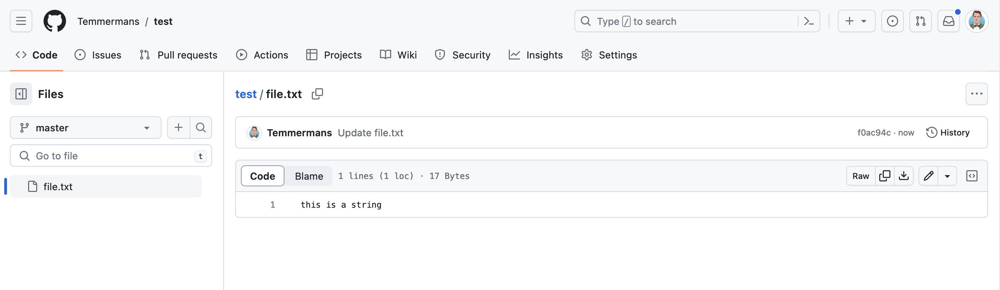

## #1 Goal for this course

> By the end of this course, **I want you to have a good understanding of what a merge conflict is and how to resolve it.**

## What is a merge conflict?

We all know that Git tracks file changes.

Let’s say you have a feature branch called `featureA` and you want to merge this feature into your master branch. Now, Git will automatically merge all the "new" pieces of code into your master branch however there will be some cases where it will not be able to do so automatically.

A merge conflict is a scenario where Git is not able to automatically merge changes as it gets confused between two different versions of code for the same file.

## Resolve a merge conflict

### Step 1: Create a new file and push it to your remote git repo

Go ahead and add a new file to the project, using any text editor you like or running a touch command. `touch newfile.txt` just creates and saves a blank file named newfile.txt.

Add the following text to the file:

```bash
mnelson:Desktop mnelson$ echo "this is a string" > file.txt
```

Commit it to your upstream repo (use `git commit` and `git push`).

### Step 2: Modify the file in your upstream repo

Navigate to your git repo and modify the content of the string directly in the browser:


Commit the changes and you should see the following:



### Step 3: Modify the file in your local repo

Now, let's modify the file in your local repo:

```bash
mnelson:Desktop mnelson$ echo "this is another string" > file.txt
```

### Step 4: Merge the changes

Now commit your changes and try to merge the changes from your upstream repo:

```bash
mnelson:Desktop mnelson$ git add .
mnelson:Desktop mnelson$ git commit -m "modify file"
mnelson:Desktop mnelson$ git pull origin master
```

### Step 5: Resolve the merge conflict

You should see something like the following:

```bash
mnelson:Desktop mnelson$ git pull origin master
From
  * branch            master     -> FETCH_HEAD
Auto-merging file.txt
CONFLICT (content): Merge conflict in file.txt
Automatic merge failed; fix conflicts and then commit the result.
```

Open the file and you should see something like this:

```bash
<<<<<<< HEAD
this is another string
=======
this is a string
>>>>>>> 1b7a7e2c5e5b5e5b5e5b5e5b5e5b5e5b5e5b5e5
```

Remove the lines that you don't want to keep and save the file.
You can now commit the changes and push them to your upstream repo.

```bash
mnelson:Desktop mnelson$ git add .
mnelson:Desktop mnelson$ git commit -m "resolve merge conflict"
mnelson:Desktop mnelson$ git push origin master
```
