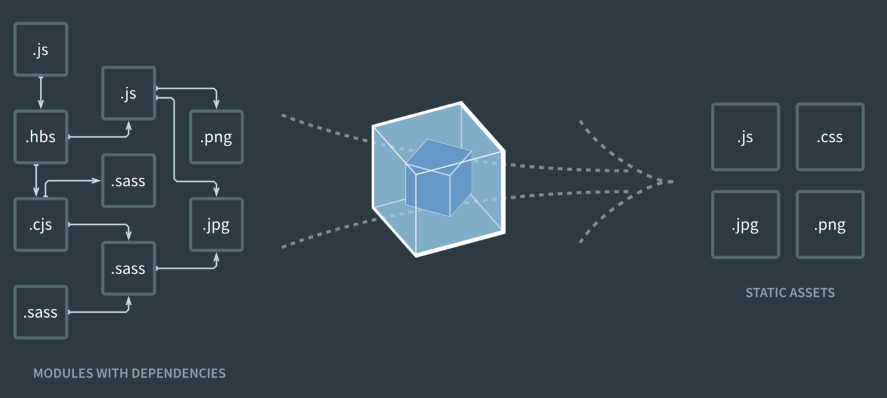

## #1 Goal for this course

> By the end of this course, **I want you to have a good understanding of the different tools used in modern javascript development.**

## Node.JS

As an asynchronous event-driven JavaScript runtime, Node.js is designed to build scalable network applications. In the following "hello world" example, many connections can be handled concurrently. Upon each connection, the callback is fired, but if there is no work to be done, Node.js will sleep.

```js
const http = require("http")

const hostname = "127.0.0.1"
const port = 3000

const server = http.createServer((req, res) => {
  res.statusCode = 200
  res.setHeader("Content-Type", "text/plain")
  res.end("Hello World")
})

server.listen(port, hostname, () => {
  console.log(
    `Server running at http://${hostname}:${port}/`,
  )
})
```

It runs on the V8 JavaScript runtime engine, and it uses event-driven, non-blocking I/O architecture, which makes it efficient and suitable for real-time applications.


1. Node.js maintains a limited thread pool to serve requests.
2. Whenever a request comes, Node.js places it into a queue.
3. Now, the single-threaded “Event loop”—the core component—comes into the picture. This event loop waits for requests indefinitely.
4. When a request comes in, the loop picks it up from the queue and checks whether it requires a blocking input/output (I/O) operation. If not, it processes the request and sends a response.
5. If the request has a blocking operation to perform, the event loop assigns a thread from the internal thread pool to process the request. There are limited internal threads available. This group of auxiliary threads is called the worker group.
6. The event loop tracks blocking requests and places them in the queue once the blocking task is processed. This is how it maintains its non-blocking nature.

Since Node.js uses fewer threads, it utilizes fewer resources/memory, resulting in faster task execution. So for our purposes, this single-threaded architecture is equivalent to multi-threaded architecture. When one needs to process data-intensive tasks, then using multi-threaded languages like Java makes much more sense. But for real-time applications, Node.js is the obvious choice.

Let's illustrate how servers work using a raspberry pi.

Let's create a very simple server that counts the number of times you hit a route.

```js
const express = require("express")
const app = express()
const port = 3000

const hits = {}

app.get("/hit/:name/count", (req, res) => {
  const { name } = req.params
  if (hits[name]) {
    hits[name]++
  } else {
    hits[name] = 1
  }
  res.status(200).send("Done!")
})

app.get("/info/:name/count", (req, res) => {
  const { name } = req.params
  res.status(200).json({
    name,
    count: hits[name] || 0,
  })
})

app.listen(port, () => {
  console.log(`Example app listening on port ${port}`)
})
```

If we deploy this code on the raspberry pi, we can hit the routes (server) from our laptops (clients) and see the results.

You see the clients store the state of the application. The client doesn't know anything about how many times you already hit the route.

Now if you are using an application on the cloud, just imagine a data center somewhere with a million of those raspberry pi's running server code, ready to respond to client applications.

Now, copy the HTML and CSS from the [Counting Events](https://learn.simoncodes.be/course/vanilla-javascript/23-practice/#counting-events) exercise. Use the API from the Pi and display the count on the screen.

## NPM

npm is two things: first and foremost, it is an online repository for the publishing of open-source Node.js projects; second, it is a command-line utility for interacting with said repository that aids in package installation, version management, and dependency management. A plethora of Node.js libraries and applications are published on npm, and many more are added every day. These applications can be searched for on [NPM](https://www.npmjs.com/). Once you have a package you want to install, it can be installed with a single command-line command.

```sh
npm install react
```

### Package.json

Your package.json holds important information about the project. It contains human-readable metadata about the project (like the project name and description) as well as functional metadata like the package version number and a list of dependencies required by the application.

```json
{
  "name": "my-project",
  "version": "1.5.0",
  "description": "Express server project using compression",
  "main": "src/index.js",
  "scripts": {
    "start": "node index.js",
    "dev": "nodemon",
    "lint": "eslint **/*.js"
  },
  "dependencies": {
    "express": "^4.16.4",
    "compression": "~1.7.4"
  },
  "devDependencies": {
    "eslint": "^5.16.0",
    "nodemon": "^1.18.11"
  },
  "repository": {
    "type": "git",
    "url": "https://github.com/osiolabs/example.git"
  },
  "author": "Jon Church",
  "contributors": [
    {
      "name": "Amber Matz",
      "email": "example@example.com",
      "url": "https://www.osiolabs.com/#team"
    }
  ],
  "keywords": [
    "server",
    "osiolabs",
    "express",
    "compression"
  ]
}
```

## Linters

JavaScript linters are tools that you can use to help you debug your code.

They scan your scripts for common issues and errors, and give you back a report with line numbers that you can use to fix things.

In addition to actual bugs and errors, they also check for subjective, stylistic preferences as well. Did you include a space between the function name and parentheses? Did you use single or double quotes around strings? Things like that.

[ESLint](https://eslint.org/) is the most popular one at the moment.

This is an example .eslintrc.json file. It is automatically picked up by the vs code editor.

```json
{
  "root": true,
  "extends": [
    "eslint:recommended",
    "plugin:@typescript-eslint/recommended"
  ],
  "parser": "@typescript-eslint/parser",
  "parserOptions": { "project": ["./tsconfig.json"] },
  "plugins": ["@typescript-eslint"],
  "rules": {
    "@typescript-eslint/strict-boolean-expressions": [
      2,
      {
        "allowString": false,
        "allowNumber": false
      }
    ]
  },
  "ignorePatterns": [
    "src/**/*.test.ts",
    "src/frontend/generated/*"
  ]
}
```

You can find all the things you can configure in the playground [here](https://eslint.org/play/).

<iframe src="https://stackblitz.com/edit/node-6u6hnu?embed=1&file=src/index.js&view=editor"></iframe>

## Module bundlers & Task Runners



### Webpack

The smallest project you can bundle with webpack consists of input and output. The bundling process begins from user-defined entries. Entries themselves are modules and can point to other modules through imports.

When you bundle a project using webpack, it traverses the imports, constructing a dependency graph of the project and then generates output based on the configuration. Additionally, it's possible to define split points to create separate bundles within the project code itself.

## Compilers

A compiler is a software that converts a high-level code scripted by developers to a low-level binary code in machine language which can be easily understood and executed by the processor and this process is called compilation or code compilation. The process of converting low-level code to high-level code is called decompilation.

### Babel

Babel is a toolchain that is mainly used to convert ECMAScript 2015+ code into a backwards compatible version of JavaScript in current and older browsers or environments. Here are the main things Babel can do for you:

1. Transform syntax
2. Polyfill features that are missing in your target environment (through a third-party polyfill such as core-js)
3. Source code transformations (codemods)

### Typescript

TypeScript is a strongly typed programming language that builds on JavaScript, giving you better tooling at any scale.

Using typescript is as simple as installing it as a dev dependency and adding a tsconfig to the root of your project:

```json
{
  "compilerOptions": {
    "module": "system",
    "noImplicitAny": true,
    "removeComments": true,
    "preserveConstEnums": true,
    "outFile": "../../built/local/tsc.js",
    "sourceMap": true
  },
  "include": ["src/**/*"],
  "exclude": ["node_modules", "**/*.spec.ts"]
}
```

Let's take a look in the [Playground](https://www.typescriptlang.org/play?#code/JYOwLgpgTgZghgYwgAgPICMBWEFgMID2IAzmFAK64FTIDeAsAFDIvIBucANuRMQDwAVAHwAKAB4AuZAICUUgIJQocAJ6CA2gGsIKgjGkBdIQG4mAXyahIsRCkXK1wuk1bJQCbgBNe4qbKnoBAScEHAgpowWjEwQIOQAtsgAsioAonGJDMysAgAWoADmAIzIALzIAORg+SAFyEQQFQA0Ljk1BQBMZZXVhchgAO4EzeZMTAhEpG7EAMoE8RDpCd2CohB+MmVCyCJgBNogUmEqcv37sdPSWjp6hlutLBjYuAB0HNw+EDIv7l4+ewdkHBiFdtLp9AIDDIIuNJmBpiklolysBZvNFhkRIiMtCmAB6PHICYkeGo7EJKS7c6HIEgE5bM6A1HJNIZJhAA)
