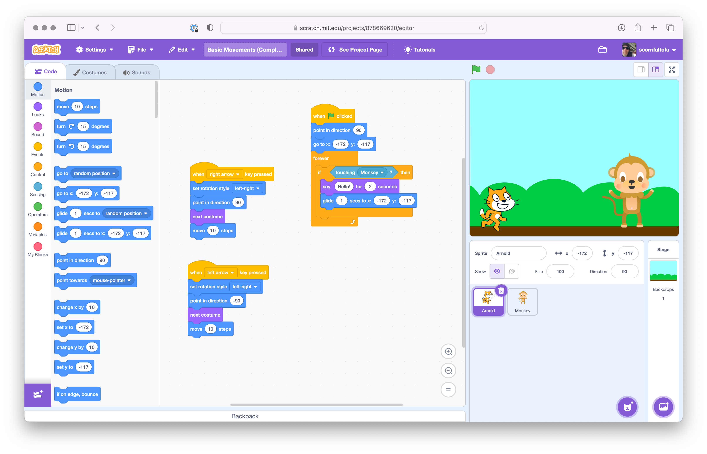
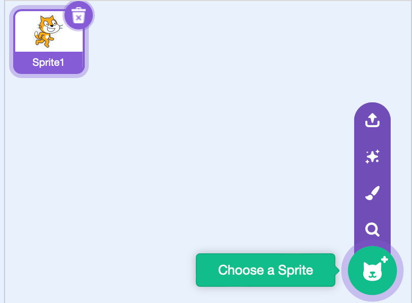
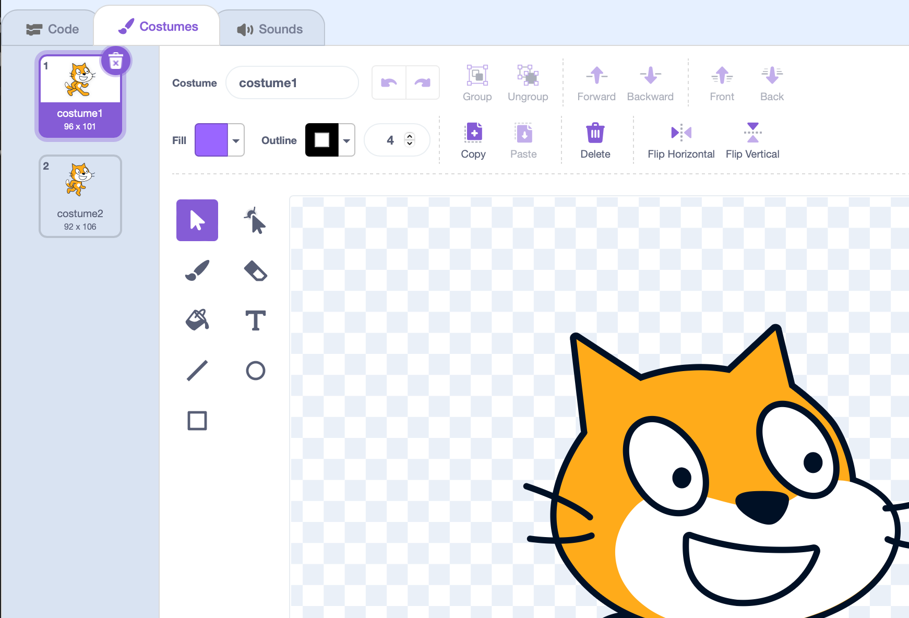
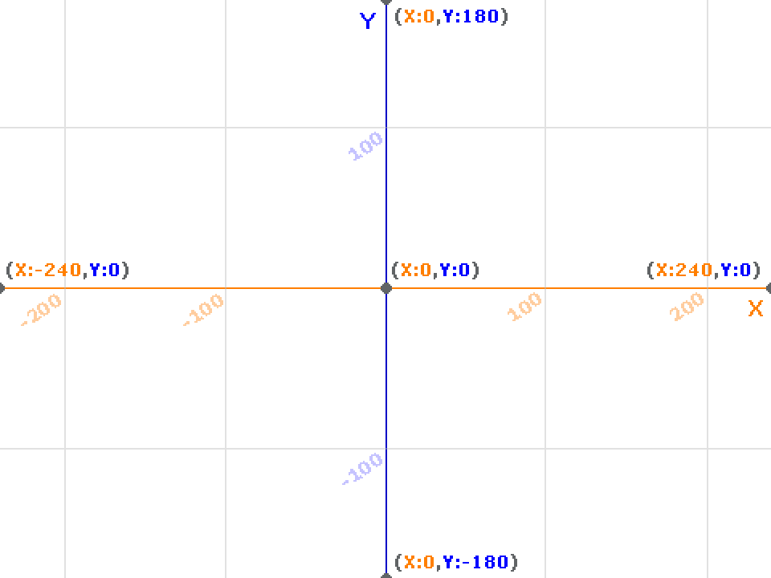

## #1 Goal for this course

> By the end of this course, **I want you to easily navigate within the scratch editor.**

### Taking a look at what’s on screen.

Let’s start by taking a look at what’s on the screen and then we’ll explore each area independently.

- **Green Flag**: This starts your code.
- **Red** Stop Sign: This stops everything.
- **The** Canvas: This is where you get to see your code run.
  - **Sprites**: These are all of the things in your project. You can code each one individually. If things are not working as you expect, make sure you’re actually adding code to the thing you’re intending on adding it to.
  - **Stage** and Backdrops: This is the background image. You can switch between different backgrounds with code based on stuff that happens in your game. When you click on a backdrop, you can also add code to that backdrop as well.
- **The** Editor
  - **Code**: This is where you add your functionality to determine what should happen. You can add code to a sprite or a backdrop.
  - **Costumes**: You can customize how a given things looks or design your own things.
  - **Sounds**: You can record your own sounds or pull in sounds from the gallery.
- **Backpack**: This can be used for storing stuff that you want to use across different projects.
- **The** Menu: For the most part, this is where you’re going to do stuff like saving and making copies of stuff. You can also download and upload code.
  - **File**: This is where you save and load stuff.
  - **Turbo** Mode: You can turn this on if you’re doing something really intense and you need extra performance. You can usually leave this off.

### Backdrops

If that white background is not exciting enough for you, you can select another one that makes you happier.

### Sprites

#### Hiding and Showing

- You can also show and hide a given sprite depending on if it should be in the game at that moment.- You can also control this with code.

#### Direction

- Direction keeps track of which way your character is facing.
  - That first option with the circular arrow will rotate your sprite as you adjust the direction.
  - That middle one is super cool. It will allow you to flip the sprite to face the other way.

#### Adding Another Sprite

You can add additional sprites to your game as well. For most games, you’re almost definitely going to have more than one sprite. In fact, you will probably choose to use sprites for things like blocks, walls, and the ground—depending on the game.

- You can search Scratch’s collection of sprites.
  - If you pick “Surprise Me” then Scratch will pick a random sprite from its collection.
- You can draw your own.
- You can upload a sprite from your computer.

#### Costumes

Each sprite can have more than one costume. A lot of times, this isn’t as fancy as it sounds. Let’s take a look at the costumes that come with Arnold, our cat.

There are two costumes, but they don’t look very different. But, if you flip back and forth between them quickly enough, you’ll probably figure out why they exist.

### Code

This is where the magic happens and you can add all sorts of interesting functionality to your game. Without the code editor, I guess Scratch would just be a drawing tool, which is cool too.

In Scratch, you write code by snapping together little blocks of functionality—kind of like LEGOS.

#### Block Categories

The blocks are divided into the following categories:

- **Motion**: this is useful for making sprites move. You can’t use any of these with backdrops.
- **Looks**: These are little chunks of code for changing something about how your sprite looks, unsurprisingly.
- **Sound**: We don’t use these unless we have headphones on.
- **Events**: Okay, so this is like one of the most important areas. These are all of the things that could happen. Typically, you’ll say something like “When that happens, I want to do this.” This will be what kicks it off. The simplest possible version of this could be “When then project starts… do this!”
- **Control**: These are a bunch of helpful blocks for controlling how your code works.
- **Sensing**: It makes sense to assume that if you have more than one sprite, they might want to know something about each other. For example, if Pac-Man is touching a ghost, something should happen, right?
- **Operators**: These are useful for doing stuff like math or figuring out if something is true or not. For example, does the player have enough points to win? Did they just lose their last life?
- **Variables**: This is where you store the number of points the player has or how many lives they have left.
- **My Blocks**: This is for when you get lazy and you find yourself doing the same thing over and over. You can make a block of reusable code and just use that.

### X and Y Grid

Every position on the canvas has a number.

- `x` is right and left.
- `y` is up and down.
- If you want to move right, increase `x`.
- If you want to move left, decrease `x`.
- If you want to move up, increase `y`.
- If you want to move down, decrease `y`.

[[info]]
:bulb:
If you just drag-and-drop your sprite and put it where you want, you can skip a step because all of your blocks will already have these values included.
