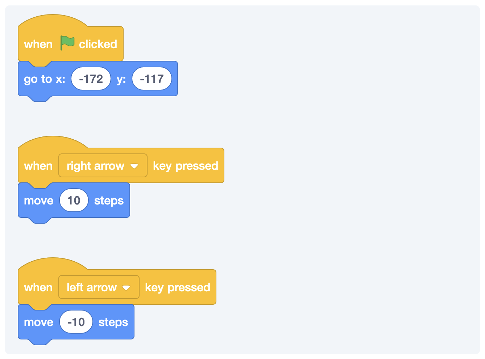

## #1 Goal for this course

> By the end of this course, **I want you to be able to move sprites around on your screen.**

### Taking Small Steps in the Right Direction

Let’s start with something super simple. We’ll have Arnold move ten steps to the right whenever we press the right arrow.

If you look closely, you’ll see the that the green flag flashes for a second. That’s totally okay. We’ll deal with that in a bit.

### Resetting the Game

Sure, we can move stuff around by hand, but it makes total sense that we might want to put everything back to where it’s suppose to whenever that game starts. That’s what that green flag is for. It’s a special event that signifies that we’re starting our game or story.

Sprites and backdrops can listen for this event and we can tell them what to do when it happens.

[[info]]
:bulb:
Can you make Arnold go in the opposite direction when the left arrow is pressed?

### Walking the Other Way

A relatively simple solution is doing something like this:

The biggest issue here is that we end up doing something that looks a bit like a moonwalk.

### Facing the Right Direction

So, we want to make Arnold face in the correct direction. We can do that by adjusting his direction based on which way he is moving.

But, this doesn’t work exactly like we might expect. I’ll repeat that: it works, but just not like we might expect.

The move block will move Arnold relative to whatever direction he is facing. So, we have him face backwards and then walk backwards. Two wrongs don’t make a right, but they do make a backwards apparently.

This is why we want to constantly test stuff out. Let’s adjust our code to deal with our changes.

### Rotating Correctly

Alright. This is way better. Maybe. But, like I just so happen to have my rotation style set to flip him back and forth. What happens if we do this?

Umm. That’s not what we want.

We’re going to need to do something about this. I don’t want to have to set everything up by hand. This is why I learned how to code. Luckily, we can program Arnold to set the rotation style to what we want before we rotate him.

### Putting Some Pep Into His Step

Remember when we saw his two different—but very similar costumes? We can use those to our advantage and have him rotate between them as he walks.

This code is duplicated and really we just want to make sure everything is set up right at the beginning, so we could do something like this:

