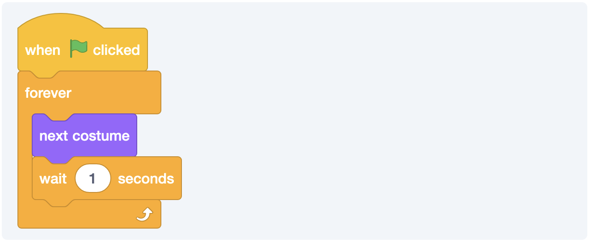
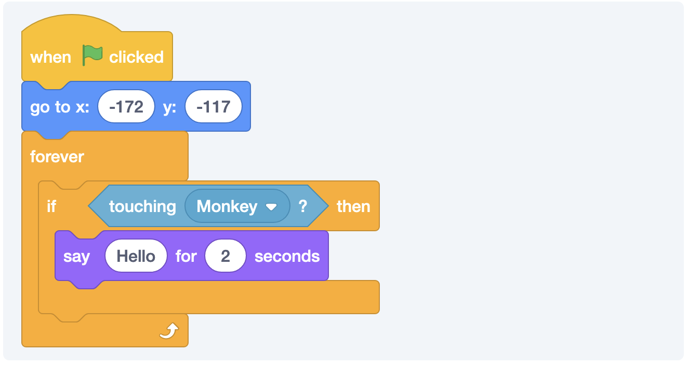
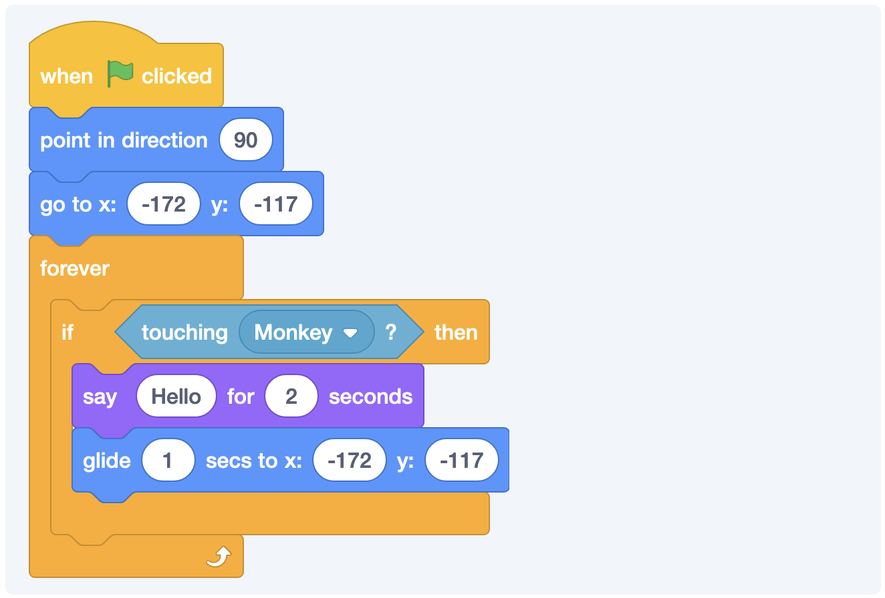
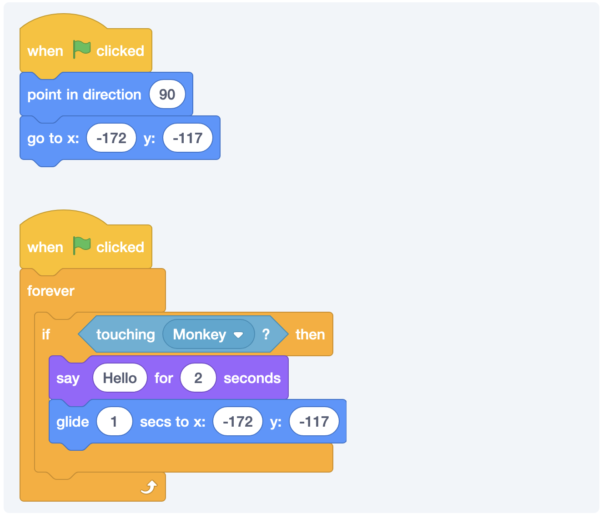

## #1 Goal for this course

> By the end of this course, **I want you to be able to explain what the concept of a game loop is.**

### Over and Over Again

A lot of games have something called a game loop. This is just a way to run some code over and over to check to see what’s happening or to update stuff constantly.

Let’s go program our other sprite for a moment.

Now, you’ll see that our monkey is cycling through it’s costumes once a second. It’s not much, but it helps show what we’re talking about. This code will run until the game stops, which right now will only happen when we hit the red stop sign.

### Sensing and Saying

We can use this loop to check for different conditions. In this case, we’re constantly checking to see if Arnold is touching the other sprite. If so, then we’ll run a little block of code. If not, we’ll just keep checking!

We could add some additional functionality that puts Arnold back where he is supposed to start as well.

You could also choose to break apart reseting the game and the game loop. It doesn’t really matter, but part of coding is keeping things organized so that it’s easy to find the piece that you need to change later.

You can see the completed version of what we have so far here.

<iframe class="mx-auto" title="A Scratch Playground" src="https://scratch.mit.edu/projects/878669620/embed" allowtransparency="true" width="485" height="402" frameborder="0" scrolling="no" allowfullscreen=""></iframe>
