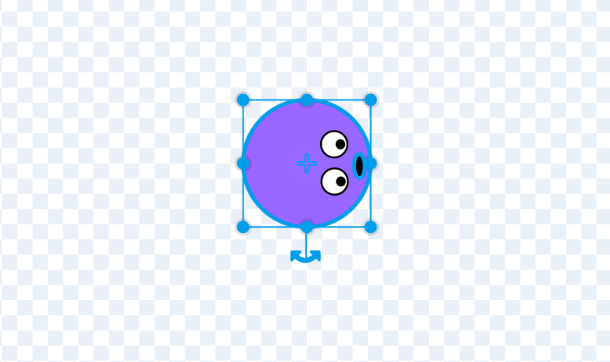
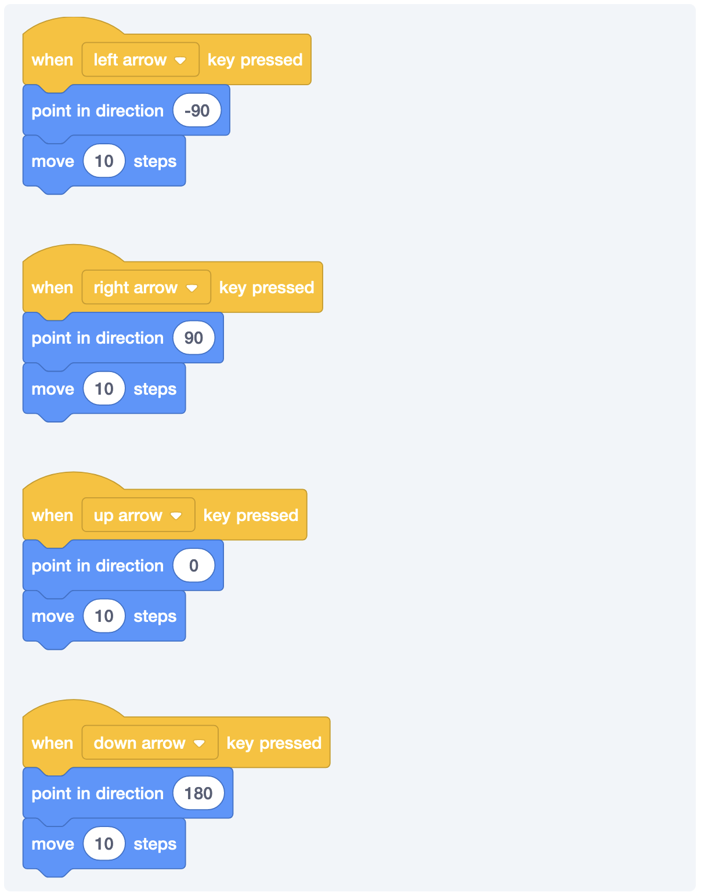

## #1 Goal for this course

> By the end of this course, **I want you to bring together the concepts we discussed before to create your first game.**

### Creating A Sprite

For our game, we’re going to need a sprite. I guess we can use one of the premade ones, but I wanted to make my own. Take a few minutes and make one for yourself. It needs to meet the following requirements for our game.

- It should be relatively the same height and width. You can hold down Shift when you’re making a shape and you should a perfectly even shape.
- Aim for around 35 pixels in both height and width.
- You want to make sure that it snaps to that little point in the center.
- It should be facing right.

As long as it meets those requirements, you should be good to go!

The little plus sign is the center point and you can rotate the sprite if you need to!

You can see the height and width of the costume in the sidebar.

### Combining Movement And The Game Loop

Let’s start with some basic set up and make sure that our little player goes where they should whenever the game begins.

It’s good practice to set your game back to a normal state whenever you run it. We’ll be doing this throughout this course.

### More Ways to Control Movement

There are a few different way to control movement. Some of it will depend on what kind of effect you’re going for.

- In some games, you have to hold down a particular key in order to make the player move. (Example: Super Mario Bros.)
- In other games, you press a given direction once and the player keeps moving in the direction until you switch directions. (Examples: Pac-Man, Snake.)

Even with those two different ways, we can take a number of approaches. I won’t bore you with all of them just now. But, I will try to sprinkle them in across some of the different examples that we build today.

Which one is the best? That’s up to you. In the last example, we did something like this.

This will work, but it has two major issues:

- It’s repetitve.
- And those key presses will still work when the game is stopped.
- It’s repetitive.

**A quick, but important, note**: In these examples, I’m using 10 as the number of steps that player will move. If this feels too fast for you then you can lower the number and the character will move a bit more slowly. The opposite is—of course—true, if you increase the number, then the player will move faster. Dial in whatever number feels right for you.

### Using a Game Loop

Alternatively, if we can do something like this:

Now, the game characters won’t move when the keys are pressed if the game is stopped. This is way better.

The cool part is that if we wanted to change the behavior to keep going in a given direction until we change directions, we can fix that pretty quickly as well.

[[info]]
:bulb:
Our little player can only go right and left. Can you get him pointed up and down as well? You can start by duplicating what we currently have and tweaking a bit.

### Adding Turning Movements

You might not choose to do this, but I want to show you that’s it’s another option for you to think creatively about what you’re trying to accomplish. Here is what we’re going to attempt:

- Our player is always moving.
- Like a race car, we can turn the wheel right or left.

We might consider something like this:

### Randomly Moving The Prize

Running after a particular taco that doesn’t move isn’t particularly fun. Let’s say that we want to move the taco whenever our player finds it.

We’re start by selecting our taco and then adding a game loop:

Great. We got a taco. But, there is something missing. I’m not feeling as celebratory as I would want to. It’s almost like if we don’t have points, then it doesn’t matter, right? Let’s look into how to keep score.

### Keep score

In order to keep score, we need a way to store the current value. This is where we’ll create a variable.

You have two options:

- Rename my variable to score.
- Make a new one.

I’ll do the first now (and the second later). Click on that fancy Make a Variable button.

You can scope a variable down to just one sprite or share it across all of them. There are different reasons to do both, but for the score, we want all of the sprites to have access to it.

If you click that little checkbox, it will show up in your game.

Okay, now whenever the player is touching the taco, we want to change the score by one.

[[info]]
:bulb:
Okay, that's cool. But we have a problem. We want to reset the score back to 0 when the game starts. Can you figure out how to make that work?

### Adding enemies

What fun is eating tacos if you didn’t avoid some enemies on your quest to get your tacos?We can create an additional sprite and have it chase our hero around.

I went for 5 steps because I wanted our enemy to be a little bit slower than our hero. But you can adjust this to whatever feels right for you. But, what do I do when the enemy gets to the player?

And now, the game will end whenever our enemy catches up the our player. You can see this iteration of the game here.

<iframe class="mx-auto" title="A Scratch Playground" src="https://scratch.mit.edu/projects/878930247/embed" allowtransparency="true" width="485" height="402" frameborder="0" scrolling="no" allowfullscreen=""></iframe>

### Making The Game Progressively Faster

There are a few ways that we could do this. The easiest of which would be to just use the score as the basis for the speed of the game. As you score more points, the game will speed up.

One easy way to do this is to just add whatever number we were using for movement to the current score.

You’ll probably want to do that for both the player and the enemy. Here is what our player will look like now.

Your enemy will look like this:

And now, you’ll see the game gets progressively harder as we eat tacos.

<iframe class="mx-auto" title="A Scratch Playground" src="https://scratch.mit.edu/projects/882159439/embed" allowtransparency="true" width="485" height="402" frameborder="0" scrolling="no" allowfullscreen=""></iframe>
