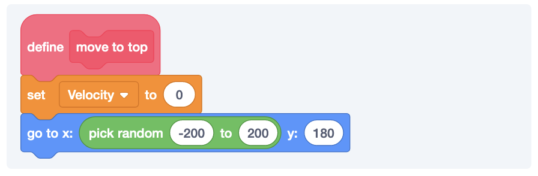

## #1 Goal for this course

> By the end of this course, **I want you to be able to understand why reusing code is important.**

### Falling

Let’s add a simple version of gravity. In this case, we want something to continue falling until it hits the ground.

Our falling works, but does feel a bit weird. This is because in the real world, things tend to speed up as their falling. We call this velocity and we can update our falling mechanic to use velocity.

### Falling With Velocity

Things tend to fall faster the more they fall. This is called velocity. If we want to make our sprite speed up as it falls, we can use a variable to store the value.

### Reusing Sprites

Instead of creating a ton of apples, we can just reuse the same one as needed.

Now, whenever the apple hits the ground, we’ll move it back to the starting position. This gives the illusion that it’s raining apples!

### Adding A Character To The Falling Game

Here is a decent start that we can build on.

#### Adding the Gravity

Pico’s not going to use the gravity just yet, but we can add the same falling logic that use used for the apples to Pico.

#### Fixing a Bug: Pico Can Fall Too Far

With our current—and super simple—velocity code, it’s possible for Pico to drop a little too far. This is probably fine and you don’t need to worry about it. But, if you really want to know one way to adjust for this, then we could basically check to see if the next time we move Pico is about to be too far.

There are a number of ways that you can do this, we’re going to start with the simplest one. We roughly know where we placed Pico. Let’s say that our floor starts at -159. I don’t want Pico to fall any further than -159. I can add this code to my repeating block.

Basically, we’re telling the sprite to do the normal falling logic until we’re about to fall too far and then just cut it short and move us to the correct right position. It’s a little messy, but it works. Here is the full code.

  
Click here to see the full code for our Pico character

### Reusable Code With Blocks

Let us add a score everytime Pico touches the apple.

This is problematic because the apple will keep falling and it will keep bumping up the score. We might consider moving the apple back to it’s starting position.

But, this makes me feel bad. We have the exact some code twice. This means, if I want to change something about the starting position, then I’ll need to change in multiple places. I’m very lazy. So, I’m going to use something called a block to create a reusable piece of code.

And now, I have a new custom piece of code that I can reuse.

So, this code is basically doing the following:

- Keep dropping.
- If you’re touching Pico, bump the score and move the apple to the top.
- If you’re touching the ground, respawn.
- If neither is true, fall a little bit faster.

### Adding Enemies To Raining Apples

Let's add a new sprite to our game. It can be something like a lightning bolt or hedgehog. We can make it fall and if it touches Pico, then the game will end.

First copy the code from the apple (that way we don't have to rewrite the fall logic).

#### Adding a Layer of Difficulty with Clones

Okay, what if we made the game harder as your score increased. We’ve already tried out the mechanic of making things faster. So, what about just starting to increase the number of lightning bolts?

Let’s start by making our falling mechanism reusable.

