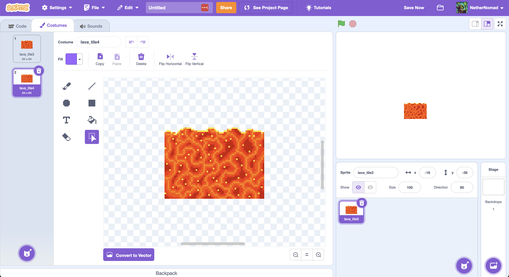

## #1 Goal for this course

> By the end of this course, **I want you to be able to create a platformer game in scratch.**

### Movement

You can use this project in scratch to follow along:

<iframe src="https://scratch.mit.edu/projects/1030521186/embed" allowtransparency="true" width="485" height="402" frameborder="0" scrolling="no" allowfullscreen></iframe>

#### Step 1

Okay, so we’re going to start with our falling mechanic again. We’re going to create a variable called velocity y. And we’ll put a game loop in having our character call until it reaches the color of the ground.

#### Step 2

So, we still have that issue where we fall through the floor, but this time, we can’t just hard-code in a y value for where the floor is because there could be more than one floor.

We need a new approach. Make a new block called fix landing and make sure that you check Run without screen refresh.

Putting the jumping motion back in is prertty straight forward at this point. We just add a listener to the space bar and then adjust the velocity y.

#### Step 3

This works, but it’s not perfect in a lot of ways. We keep inching our hero up. Here is the plan:

- Instead of letting Scratch move the character 10 steps, we’re going to write a block that moves the character slowly.
- It will keep track of the last position that it moved the character to.
- If on the next movement, we’ve gone too far,
- then move it back to the last position known to be good,
- set velocity y to 0,
- and be done with it.

#### Step 4

Lets make it move left and right. We’ll need to add a velocity x variable and then adjust the x position based on that.

Lastly we need to remove the ability to jump when already jumping. We can do this by adding a new variable called is jumping.

### Level Design

  
Use assets in the tile folders to create a level. The folder can be found <a href="https://drive.google.com/drive/folders/1YKpiMorCCZVDO1opJa273-nDcrsaCUEY?usp=drive_link" target="_blank">here.</a>

  <iframe src="https://drive.google.com/embeddedfolderview?id=1YKpiMorCCZVDO1opJa273-nDcrsaCUEY#grid" style="width:100%; height:600px; border:0;"></iframe>

This is an example of a level that you can create:

<iframe src="https://scratch.mit.edu/projects/1030396779/embed" allowtransparency="true" width="485" height="402" frameborder="0" scrolling="no" allowfullscreen></iframe>

Go ahead and create your own level!

### Sprites and Animations

Notice that the level in the previous example is static. it would be nice to have some moving parts. It would bring our scene to life.

If you look into the folder of art you might notice that we have a lot of images that are similar. This is because we can use them to create animations.

Let’s start by creating a new sprite and uploading the first image in the sequence. We can then add the rest of the images to the costumes.

We'll do some moving lava first, we want to mimic the slow rise and fall of lava. Download lava tile <a href="https://drive.google.com/file/d/1NB9Lu5oWTm4zOhqKx0jScXRktOskwKFP/view?usp=drive_link" target="_blank">3</a> and <a target="_blank" href="https://drive.google.com/file/d/10wDWe409Ro6fGOuf8w9Ps7X16FCX5XuB/view?usp=drive_link">4</a>.

Upload tile 3 in the scratch editor and open the customes tab.

Now, add tile 4 as a new costume.

Add the code from the following screenshot and notice how the lava is sloshing back and forth!

Go ahead and create some more animations (maybe the candles or some dripping lava?). Use those moving sprites in your level!

### Enemy and Hero sprites

Let's try to build something like this:

<iframe src="https://scratch.mit.edu/projects/1030542582/embed" allowtransparency="true" width="485" height="402" frameborder="0" scrolling="no" allowfullscreen></iframe>
