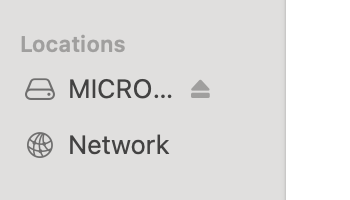

## #1 Goal for this course

> By the end of this course, **I want you to be able to learn what Micro:bit is and how to combine robotics with code.**

### What is Micro:bit?

The Micro:bit is a small computer that you can use to code and create projects. It has a 5x5 LED display, buttons, sensors, and many other features that you can use to create interactive projects.

### Linking Scratch and Micro:bit

Install the Scratch Link software on your computer and connect your Micro:bit to it. You can find it on the following link: [Scratch Link](https://scratch.mit.edu/microbit).

Download the Scratch Micro:bit HEX file from the following link: [Scratch HEX](https://downloads.scratch.mit.edu/microbit/scratch-microbit.hex.zip).

Drop the HEX file into your Micro:bit and you're ready to go!

### Creating a Project

Connect the Micro:bit to your computer and open Scratch.

You can now use the Micro:bit blocks to control the Micro:bit from Scratch.

### Example Project

Here's an example project that uses the Micro:bit to control a sprite in Scratch.

<iframe src="https://scratch.mit.edu/projects/1031059677/embed" allowtransparency="true" width="485" height="402" frameborder="0" scrolling="no" allowfullscreen></iframe>

### Disconnect

Always make sure to properly disconnect the micro:bit from your computer when you're done using it.
Click on the checkmark in the editor:

And then click on the disconnect button:

Also make sure the eject the micro:bit from your computer before removing it:

