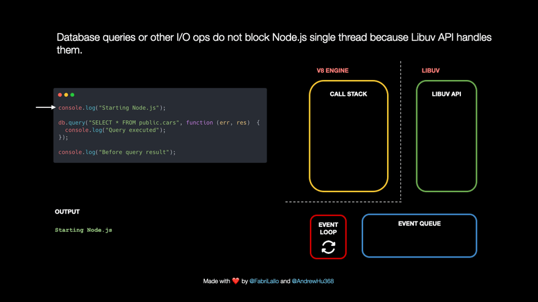

## The event Loop

JavaScript is single-threaded: only one task can run at a time. Usually that’s no big deal, but now imagine you’re running a task which takes 30 seconds. During that task we’re waiting for 30 seconds before anything else can happen (JavaScript runs on the browser’s main thread by default, so the entire UI is stuck) 😬

Luckily, the browser gives us some features that the JavaScript engine itself doesn’t provide: a Web API. This includes the DOM API, setTimeout, HTTP requests, and so on. This can help us create some async, non-blocking behavior 🚀

When we invoke a function, it gets added to something called the call stack. The call stack is part of the JS engine, this isn’t browser specific. It’s a stack, meaning that it’s first in, last out (think of a pile of pancakes). When a function returns a value, it gets popped off the stack 👋


The respond function returns a `setTimeout` function. The `setTimeout` is provided to us by the Web API: it lets us delay tasks without blocking the main thread. The callback function that we passed to the setTimeout function, the arrow function `() => { return 'Hey' }` gets added to the Web API. In the meantime, the setTimeout function and the respond function get popped off the stack, they both returned their values!


[[info | :bulb: Theme: Node.JS async execution]]
| A similar thing happens when we run javascript in a nodejs environment. Instead of the web API (which is
| ofcourse a browser thing), nodejs has the libuv API.
| 

Time for the event loop to do its only task: connecting the queue with the call stack! If the call stack is empty, so if all previously invoked functions have returned their values and have been popped off the stack, the first item in the queue gets added to the call stack. In this case, no other functions were invoked, meaning that the call stack was empty by the time the callback function was the first item in the queue.


### Some Practice

What does the following log:

```js
const foo = () => console.log("First")
const bar = () =>
  setTimeout(() => console.log("Second"), 500)
const baz = () => console.log("Third")

bar()
foo()
baz()
```


### [JS Visualizer playground](https://www.jsv9000.app/?code=c2V0VGltZW91dChmdW5jdGlvbiBhKCkgeyBjb25zb2xlLmxvZygnTWFjcm8gVGFzaycpIH0sIDApOwoKUHJvbWlzZS5yZXNvbHZlKCkKLnRoZW4oZnVuY3Rpb24gYigpIHsgY29uc29sZS5sb2coJ01pY3JvIHRhc2snKSB9KTsKCmNvbnNvbGUubG9nKCdZbycpOw%3D%3D)

<iframe src="https://www.jsv9000.app/?code=c2V0VGltZW91dChmdW5jdGlvbiBhKCkgeyBjb25zb2xlLmxvZygnTWFjcm8gVGFzaycpIH0sIDApOwoKUHJvbWlzZS5yZXNvbHZlKCkKLnRoZW4oZnVuY3Rpb24gYigpIHsgY29uc29sZS5sb2coJ01pY3JvIHRhc2snKSB9KTsKCmNvbnNvbGUubG9nKCdZbycpOw%3D%3D"></iframe>

## Promises

JavaScript is single threaded, meaning that two bits of script cannot run at the same time; they have to run one after another. A Promise is an object that represents the eventual completion (or failure) of an asynchronous operation, and its resulting value.

```js
var promise = new Promise(function(resolve, reject) {
  // do thing, then…

  if (/* everything worked */) {
    resolve("See, it worked!");
  }
  else {
    reject(Error("It broke"));
  }
});
```

### A Promise exists in one of these states

- Pending: initial state, neither fulfilled nor rejected.
- Fulfilled: operation completed successfully.
- Rejected: operation failed.

The Promise object works as proxy for a value not necessarily known when the promise is created. It allows you to associate handlers with an asynchronous action’s eventual success value or failure reason.

This lets asynchronous methods return values like synchronous methods: instead of immediately returning the final value, the asynchronous method returns a promise to supply the value at some point in the future.

### Using ‘Then’ (Promise Chaining)

To take several asynchronous calls and synchronize them one after the other, you can use promise chaining. This allows using a value from the first promise in later subsequent callbacks.

```js
Promise.resolve("some")
  .then(function (string) {
    // <-- This will happen after the above Promise resolves (returning the value 'some')
    return new Promise(function (resolve, reject) {
      setTimeout(function () {
        string += "thing"
        resolve(string)
      }, 1)
    })
  })
  .then(function (string) {
    // <-- This will happen after the above .then's new Promise resolves
    console.log(string) // <-- Logs 'something' to the console
  })

var add = function (x, y) {
  return new Promise((resolve, reject) => {
    var sum = x + y
    if (sum) {
      resolve(sum)
    } else {
      reject(Error("Could not add the two values!"))
    }
  })
}

var subtract = function (x, y) {
  return new Promise((resolve, reject) => {
    var sum = x - y
    if (sum) {
      resolve(sum)
    } else {
      reject(Error("Could not subtract the two values!"))
    }
  })
}

// Starting promise chain
add(2, 2)
  .then((added) => {
    // added = 4
    return subtract(added, 3)
  })
  .then((subtracted) => {
    // subtracted = 1
    return add(subtracted, 5)
  })
  .then((added) => {
    // added = 6
    return added * 2
  })
  .then((result) => {
    // result = 12
    console.log("My result is ", result)
  })
  .catch((err) => {
    // If any part of the chain is rejected, print the error message.
    console.log(err)
  })
```

### Creating Promises around old callback functions

A Promise can be created from scratch using its constructor.

In an ideal world, all asynchronous functions would already return promises. Unfortunately, some APIs still expect success and/or failure callbacks to be passed in the old way. The most obvious example is the setTimeout() function:

```js
setTimeout(
  () => saySomething("10 seconds passed"),
  10 * 1000
)
```

Mixing old-style callbacks and promises is problematic. If saySomething() fails or contains a programming error, nothing catches it. setTimeout is to blame for this.

Luckily we can wrap setTimeout in a promise. Best practice is to wrap problematic functions at the lowest possible level, and then never call them directly again:

```js
const wait = (ms) =>
  new Promise((resolve) => setTimeout(resolve, ms))

wait(10 * 1000)
  .then(() => saySomething("10 seconds"))
  .catch(failureCallback)
```

Basically, the promise constructor takes an executor function that lets us resolve or reject a promise manually. Since setTimeout() doesn't really fail, we left out reject in this case.

### Async/await

There’s a special syntax to work with promises, called “async/await”. It’s surprisingly easy to understand and use.

#### Async

Let’s start with the async keyword. It can be placed before a function, like this:

```js
async function f() {
  return 1
}
```

The word “async” before a function means one simple thing: a function always returns a promise. Other values are wrapped in a resolved promise automatically.

For instance, this function returns a resolved promise with the result of 1; let’s test it:

```js
async function f() {
  return 1
}

f().then(alert) // 1
```

#### Await

The keyword await makes JavaScript wait until that promise settles and returns its result.

Here’s an example with a promise that resolves in 1 second:

```js
async function f() {
  let promise = new Promise((resolve, reject) => {
    setTimeout(() => resolve("done!"), 1000)
  })

  let result = await promise // wait until the promise resolves (*)

  alert(result) // "done!"
}

f()
```

### Common mistakes

> [!ATTENTION]
> Bad example! Spot 3 mistakes!

```js
doSomething()
  .then(function (result) {
    doSomethingElse(result).then((newResult) =>
      doThirdThing(newResult)
    )
  })
  .then(() => doFourthThing())
```

1. The first mistake is to not chain things together properly. This happens when we create a new promise but forget to return it. As a consequence, the chain is broken, or rather, we have two independent chains racing. This means doFourthThing() won't wait for doSomethingElse() or doThirdThing() to finish, and will run in parallel with them, likely unintended. Separate chains also have separate error handling, leading to uncaught errors.

2. The second mistake is to nest unnecessarily, enabling the first mistake. Nesting also limits the scope of inner error handlers, which—if unintended—can lead to uncaught errors.

3. The third mistake is forgetting to terminate chains with catch. Unterminated promise chains lead to uncaught promise rejections in most browsers.

> [!TIP]
> Better 💪

```js
doSomething()
  .then(function (result) {
    // If using a full function expression: return the promise
    return doSomethingElse(result)
  })
  // If using arrow functions: omit the braces and implicitly return the result
  .then((newResult) => doThirdThing(newResult))
  // Even if the previous chained promise returns a result, the next one
  // doesn't necessarily have to use it. You can pass a handler that doesn't
  // consume any result.
  .then((/* result ignored */) => doFourthThing())
  // Always end the promise chain with a catch handler to avoid any
  // unhandled rejections!
  .catch((error) => console.error(error))
```

### Promise API

There are 4 static methods in the Promise class:

- Promise.resolve
- Promise.reject
- Promise.all
- Promise.race

#### Promise.all

The Promise.all(iterable) method returns a single Promise that resolves when all of the promises in the iterable argument have resolved or when the iterable argument contains no promises. It rejects with the reason of the first promise that rejects.

```js
var promise1 = Promise.resolve(catSource)
var promise2 = Promise.resolve(dogSource)
var promise3 = Promise.resolve(cowSource)

Promise.all([promise1, promise2, promise3]).then(function (
  values
) {
  console.log(values)
})
// expected output: Array ["catData", "dogData", "cowData"]
```
